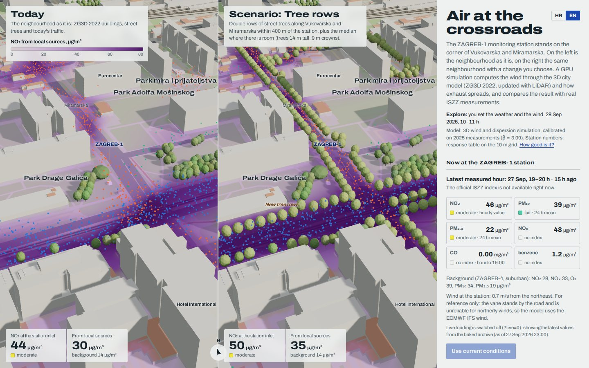

# Zrak na raskrižju · Air at the crossroads

**How traffic pollution moves around the ZAGREB-1 air-quality station, in 3D, in your browser.**

The ZAGREB-1 station stands at the corner of Vukovarska and Miramarska in Zagreb. This page rebuilds the neighbourhood
from the City of Zagreb's LiDAR-updated 3D model (ZG3D 2022). A GPU simulation blows the wind through it and lets the
exhaust from each street spread. The result is compared with what the station actually measured. On the left is
the neighbourhood **as it is**. On the right is the same neighbourhood **with a change you choose**: street-tree rows, a
new building, a car-free Miramarska, a low-emission zone, electric buses, less traffic. Set the wind, the hour and the
traffic, and see where NO₂ builds up.



It is the ZAGREB-1 counterpart of [maksimir-pod-kisom](https://github.com/ivanrezic/maksimir-pod-kisom), which compares
today's and tomorrow's Maksimir stadium in wind and rain. The GPU wind tunnel is adapted from that project.

> **Note:** like the reference repo, this project was built with AI. Every number in it is traceable: the research
> reports in [`docs/research/`](docs/research/) source or test each assumption. The model is calibrated and scored on
> held-out data ([docs/07](docs/07-calibration.md)), and [docs/09](docs/09-limitations.md) lists its limits honestly.
> It is a tool for comparison and explanation, not a regulatory model.

## What you can do

- **See the flow.** Wind streaks, particles released from the roads, and a concentration layer at any height (default:
  the station's 4 m inlet).
- **Compare two cities.** Today against a scenario. The panel shows the station value, the local share, source
  attribution (Vukovarska / Miramarska / other roads / heating / background) and the nearest school.
- **Set the conditions.** Presets (winter morning rush, summer afternoon, Sunday night, NE or SW wind, *now*, *+24 h*),
  wind speed and direction, stability, mixing height, date and hour, traffic per street, rush-hour queues, heating
  season, trees in leaf or not, pollutant (NO₂, NOx, PM₁₀, PM₂.₅, CO, benzene).
- **Check the model.** 72 h of live ISZZ measurements against the model's hindcast, a 16-direction pollution rose
  (modelled against measured), and "How good is it?" from the calibration's held-out scores.
- **Look ahead.** A 72 h forecast at the station from ECMWF IFS weather and the CAMS background (bias-corrected to
  ZAGREB-4). Click an hour to see it in 3D.
- **Explore the data.** Measured daily cycles, monthly and annual means against EU and WHO limits, and exceedances.

The interface is in Croatian and English (HR/EN toggle).

## How it works

```
ZG3D 2022 (LiDAR-updated LoD2) ─┐
DGU terrain (20 m)  ────────────┼─► env.json ─┐                         ┌─► Γ at the station (lookup table) ─► calibration (β, U₀)
OpenStreetMap (roads, trees) ───┘             │                         │
                                              ├─► GPU wind (LBM D3Q19) ─┼─► GPU dispersion: 4 source groups + plume age
ISZZ ZAGREB-1 + ZAGREB-4 ─┐                   │                         │
ECMWF IFS (Open-Meteo) ───┴─► measurements ───┘                         └─► ΔC = 10⁶·β·Σ q_k·Γ_k / √(U² + U₀²)  + background, NO₂ chemistry
```

1. **Wind.** A Lattice-Boltzmann simulation (D3Q19 with Smagorinsky turbulence) on the GPU, 600 × 600 × 160 m at 5 m,
   rotated to face each of 16 wind directions. It uses an urban log-law inflow matched to the 10 m weather-model wind
   ([docs/03](docs/03-flow-lbm.md)).
2. **Dispersion.** A steady advection–diffusion solve on the mean flow, with K-theory turbulence and a TVD scheme. It
   computes unit responses Γ for four source groups (Vukovarska, Miramarska, other roads, domestic heating) and a plume
   age for the chemistry. It is verified against analytic solutions, mass balance and symmetry ([docs/04](docs/04-dispersion.md)).
3. **Emissions.** AADT × time profile × fleet emission factors, and the scenario measures ([docs/05](docs/05-emissions.md)).
   Everything is linear, so traffic, pollutant, hour and wind speed change instantly without re-simulating.
4. **Chemistry and background.** NO–NO₂–O₃ with a finite reaction time. Background from the suburban station ZAGREB-4,
   or CAMS in the forecast ([docs/06](docs/06-chemistry.md)).
5. **Calibration.** β and U₀ are fitted on half of 2025 and scored on the other half, with Chang & Hanna metrics and a
   statistical baseline ([docs/07](docs/07-calibration.md)).

## Quick start

```sh
python3 tools/build.py                 # src/ -> dist/index.html (Python 3 standard library only)
python3 -m http.server -d dist         # open http://localhost:8000
```

Everything the page needs is already in `src/data/`. To rebuild the data from the sources:

```sh
make data        # ISZZ + Open-Meteo measurements, ZG3D + DGU + OSM geometry
make lut         # receptor lookup table from the GPU model (needs playwright; slow without a GPU)
make calibrate   # fit and score against held-out measurements
make test        # Python unit tests + in-page test suite in headless Chromium
```

See the [runbook](docs/10-runbook.md) for every command, option and troubleshooting step.

## Repository layout

```
config/site.json      every constant: station, frame, APIs, model defaults
tools/                Python data pipeline (stdlib): fetch_*.py, build_env.py, build_measurements.py,
                      aqmodel.py (Python mirror of the model), calibrate.py, export_lut.py, build.py
src/                  page.html, style.css, js/ (one shared-scope ES module, see docs/architecture.md), data/
tests/                python/ (unit tests with fixtures), browser/ (headless Chromium harness, selftest, smoke, e2e)
docs/                 00–12 chapters, architecture contract, research reports, glossary, references
.github/workflows/    pages.yml (deploy), tests.yml (CI), refresh-data.yml (weekly data refresh)
```

## Documentation

| | |
|---|---|
| [00 Overview](docs/00-overview.md) | What it is and how the pieces fit |
| [01 Data sources](docs/01-data-sources.md) | ISZZ API, Open-Meteo, CAMS: endpoints, time semantics, limits |
| [02 Geometry](docs/02-geometry.md) | ZG3D / LiDAR, terrain, OSM, the local frame, validation |
| [03 Wind](docs/03-flow-lbm.md) · [04 Dispersion](docs/04-dispersion.md) | The GPU solvers, equations and verification |
| [05 Emissions](docs/05-emissions.md) · [06 Chemistry](docs/06-chemistry.md) | Traffic, fleet, heating, NO₂, limits, index |
| [07 Calibration](docs/07-calibration.md) | How good it is, on held-out data |
| [08 User guide](docs/08-user-guide.md) | Every control, explained |
| [09 Limitations](docs/09-limitations.md) | What the model cannot do |
| [10 Runbook](docs/10-runbook.md) · [11 Process](docs/11-process.md) | Commands, and how the repo was built step by step |
| [Architecture](docs/architecture.md) · [Research](docs/research/) | The interface contract, and the five research reports |

## Sources and licences

- **Code:** MIT (see [LICENSE](LICENSE)). It includes the MIT notice of maksimir-pod-kisom © 2026 Ivan Rezić, whose
  GPU wind tunnel and page structure this project adapts.
- **Data:** each dataset keeps its own licence; see [DATA_LICENSES.md](DATA_LICENSES.md).
  - Measurements: *Izvor podataka: MZOZT – Kvaliteta zraka u Republici Hrvatskoj (iszz.azo.hr); mjerenja DHMZ*.
  - Buildings: *© Grad Zagreb – ZG3D 2022*, Otvorena dozvola.
  - Terrain: *© DGU*, Otvorena dozvola.
  - Streets and trees: *© OpenStreetMap contributors*, ODbL.
  - Weather: *Open-Meteo.com (CC BY 4.0), ECMWF IFS*.
  - Background forecast: *Copernicus Atmosphere Monitoring Service*.

Suggestions and corrections are welcome as issues or pull requests.
