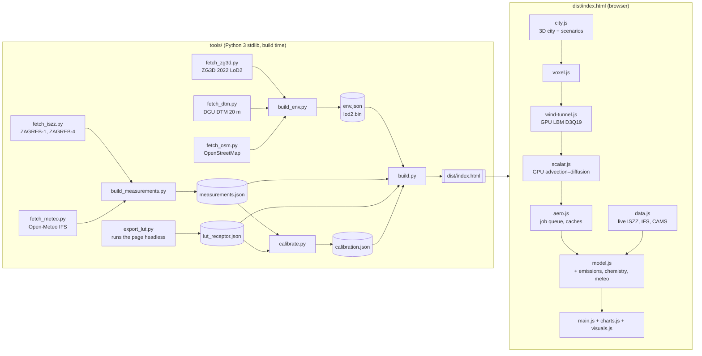

# 00 · Overview

**Zrak na raskrižju / Air at the crossroads** shows, in 3D, how traffic and heating pollution spreads around the
**ZAGREB-1** air-quality monitoring station at the corner of Vukovarska and Miramarska in Zagreb. It compares the
model with what the station actually measured, forecasts the next three days, and lets you change the neighbourhood
(tree rows, a new building, a car-free street, a low-emission zone, …) to see what would change.

It is the ZAGREB-1 counterpart of [maksimir-pod-kisom](https://github.com/ivanrezic/maksimir-pod-kisom). That app puts
today's and tomorrow's Maksimir stadium side by side in wind and rain. This one puts **today's neighbourhood** and a
**scenario** side by side, in wind and exhaust.

## 0.1 What you see

- **Two 3D views.**
  - Left: *Today*, the city as built. Buildings come from the City of Zagreb's LiDAR-updated ZG3D 2022 model; streets
    and trees come from OpenStreetMap.
  - Right: *Scenario*, the same city with one change you choose.
- **A concentration layer** at a chosen height (default 4 m, the height of the station's air inlet), **particles**
  released from the roads, and optional **wind streaks**. All three follow the simulated wind through the buildings.
- **Numbers at the station inlet.** The modelled NO₂, NOx, PM₁₀, PM₂.₅, CO or benzene, split into background and local
  sources (Vukovarska, Miramarska, other roads, domestic heating), next to the live ISZZ measurement.
- **Model vs measurements.** A 72 h comparison with the station. A 16-direction pollution rose, modelled against
  measured. The calibration's held-out scores ("How good is it?").
- **Forecast.** The next 72 h at the station, from the ECMWF IFS weather forecast and the CAMS background forecast.
- **Data.** Measured daily cycles, monthly and annual means against EU and WHO limits, exceedances.

## 0.2 How it works (one paragraph)

The page is one self-contained HTML file.

1. The GPU simulates the wind through the 3D city with a **Lattice-Boltzmann** method. There is one run per wind
   direction, rotated so that the wind always enters from one side (as in the reference repo).
2. On that frozen mean flow, a second GPU solver computes the **steady spread of a unit emission** from each of four
   source groups (Vukovarska, Miramarska, other roads, heating), plus the plume's travel time.
3. Everything the user changes afterwards is instant arithmetic, because dispersion is linear in the emissions and
   scales as 1/U with wind speed. That covers traffic volume, fleet measures, pollutant, hour of day, wind speed and
   background:

       ΔC = 10⁶ · β · Σ_k q_k · Γ_k / √(U² + U₀²)

4. NO₂ comes from NOx through a finite-reaction-time NO–NO₂–O₃ scheme. The total is the measured suburban background
   (ZAGREB-4) plus the local increment.
5. A receptor lookup table (Γ at the station for 16 directions × 3 stability groups × 4 source groups) is
   precomputed. It is used for instant forecasts and for the calibration of β and U₀ against held-out ISZZ data.

The source groups are **A** Vukovarska, **B** Miramarska, **C** all other motor roads and **D** domestic heating. The
stability groups are **AC** (unstable), **D** (neutral) and **EF** (stable). Every time is UTC and **hour-ending**, as
in ISZZ: the value stamped 10:00 is the mean of 09:00–10:00 ([glossary](glossary.md)). The details are in
[03 Wind](03-flow-lbm.md) (step 1), [04 Dispersion](04-dispersion.md) (step 2), [05 Emissions](05-emissions.md) and
[06 Chemistry](06-chemistry.md) (steps 3–4) and [07 Calibration](07-calibration.md) (step 5).

## 0.3 The pieces



| Chapter | Topic |
|---|---|
| [01 Data sources](01-data-sources.md) | ISZZ, Open-Meteo, CAMS: endpoints, time semantics, limits, what is fetched when |
| [02 Geometry](02-geometry.md) | ZG3D / LiDAR, DTM, OSM, the local frame, env.json, validation |
| [03 Wind (LBM)](03-flow-lbm.md) | Lattice-Boltzmann tunnel, urban inflow profile, voxelisation, job queue, LUT |
| [04 Dispersion](04-dispersion.md) | Steady advection–diffusion, closure, scheme, verification T1–T6 |
| [05 Emissions](05-emissions.md) | Traffic, fleet, emission factors, time profiles, heating, measures |
| [06 Chemistry](06-chemistry.md) | NO–NO₂–O₃, background, limit values, air-quality index |
| [07 Calibration](07-calibration.md) | Protocol, metrics, current results, baseline |
| [08 User guide](08-user-guide.md) | Every control, explained |
| [09 Limitations](09-limitations.md) | What the model cannot do, honestly |
| [10 Runbook](10-runbook.md) | Refresh data, rebuild, export the LUT, recalibrate, deploy, troubleshoot |
| [11 Process](11-process.md) | How the repo was researched and built, step by step |
| [12 Rendering](12-rendering.md) | The 3D scene, scenarios, colour scales |
| [Architecture](architecture.md) | The binding interface contract between the modules |
| [Research](research/) | The five research reports behind every decision |
| [Glossary](glossary.md) · [References](references.md) | |

## 0.4 Key facts about the site

| | |
|---|---|
| Station | ZAGREB-1, ISZZ id 155, EoI HR0007A, urban traffic station, operated by DHMZ since 2003 |
| Position | 45.800496 N, 15.97422 E: NW corner of Vukovarska × Miramarska, east end of Park Drage Galića |
| Inlet | 4 m above ground, 9–12 m from the Miramarska kerb |
| Streets | Vukovarska: about 75–80 m wide boulevard with a central tram reservation, about 47,000 vehicles/day (estimate). Miramarska: about 20,000 vehicles/day (estimate). No public traffic counts exist. |
| Measured (2025) | NO₂ 31.7, NOx 71, PM₁₀ 27.0, PM₂.₅ 18.4 µg/m³ (annual means) |
| Local increment | Over ZAGREB-4 (suburban background): NOx +46, NO₂ +15, PM₁₀ +1.4, PM₂.₅ +2.7 µg/m³. NOx is local traffic; PM is mostly regional and domestic heating. |
| Meteorology | Weak winds (mean about 1.7 m/s at 10 m in IFS), mainly NE or SW; frequent winter inversions |

## 0.5 Current state and how to run it

- **Geometry:** `env.json` of 2026-09-28 (after the frame fix): 4,275 building parts (4,196 ZG3D, 79 OSM), 3,255
  roads, 1,807 trees, 116 heating tiles ([02 Geometry](02-geometry.md) §2.0).
- **Measurements:** ISZZ 2023-01-01 → 2026-09-27, the page embeds the last 400 days ([01 Data sources](01-data-sources.md)).
- **Model:** the embedded receptor LUT is the first one, on the 10 m grid, computed on the geometry before the frame
  fix. A 5 m LUT is being exported; when it is in, the calibration is redone and [07 Calibration](07-calibration.md)
  §9 is regenerated. Quote calibration numbers from there.
- **Tests:** 120 Python unit tests and 85 in-page tests (78 fast, 7 slow), plus an end-to-end browser test
  ([10 Runbook](10-runbook.md) §10.5).

```sh
python3 tools/build.py                 # src/ -> dist/index.html
python3 -m http.server 8000 -d dist    # open http://localhost:8000
```

Every other command (data refresh, LUT export, calibration, tests, deploy) is in [10 Runbook](10-runbook.md). How
the repository was researched and built is in [11 Process](11-process.md).
