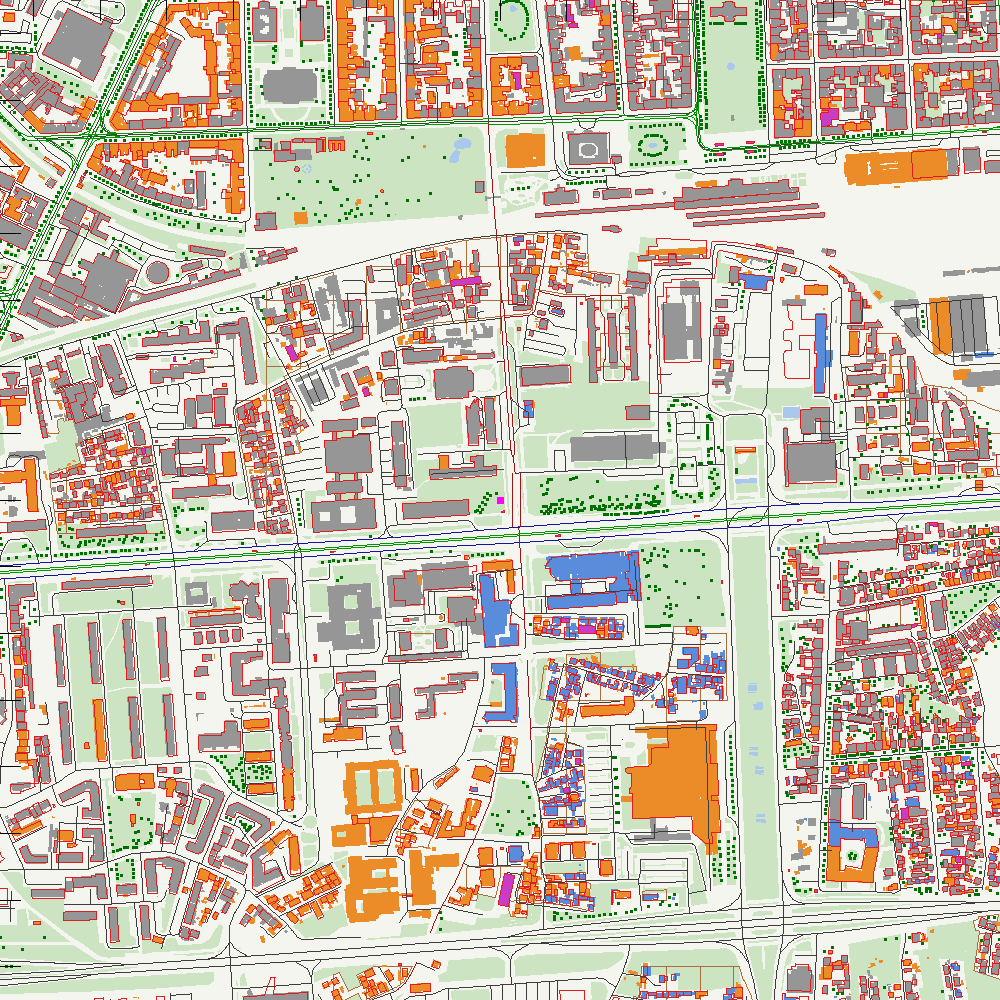
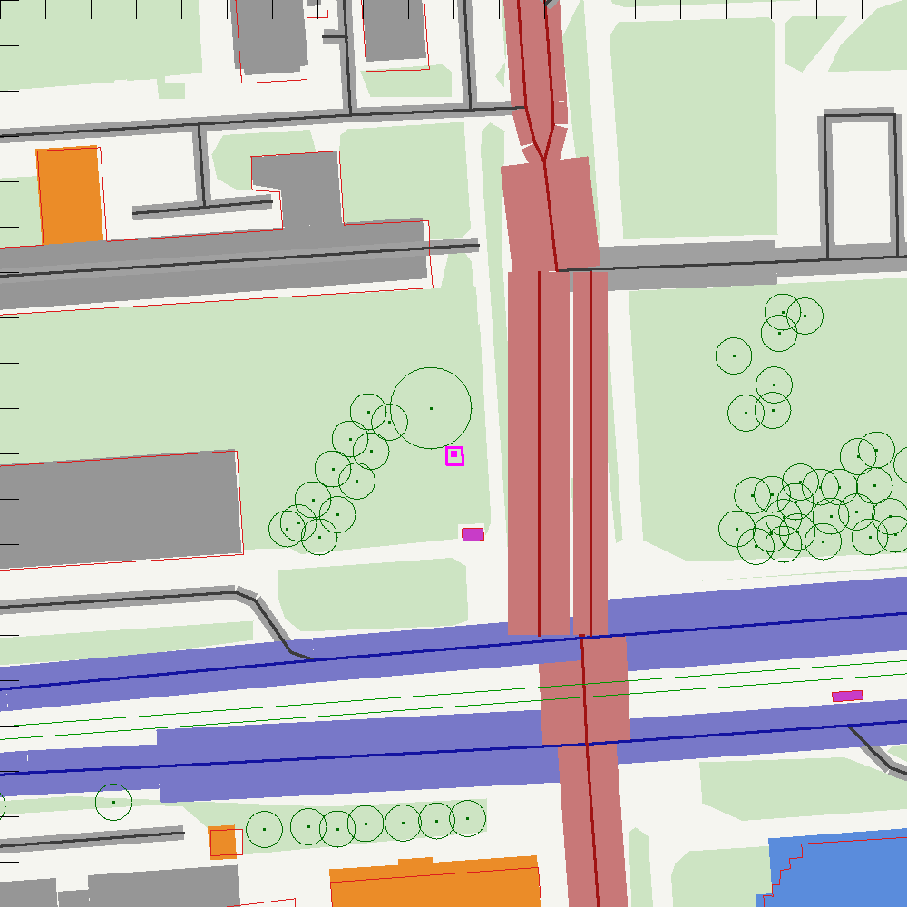
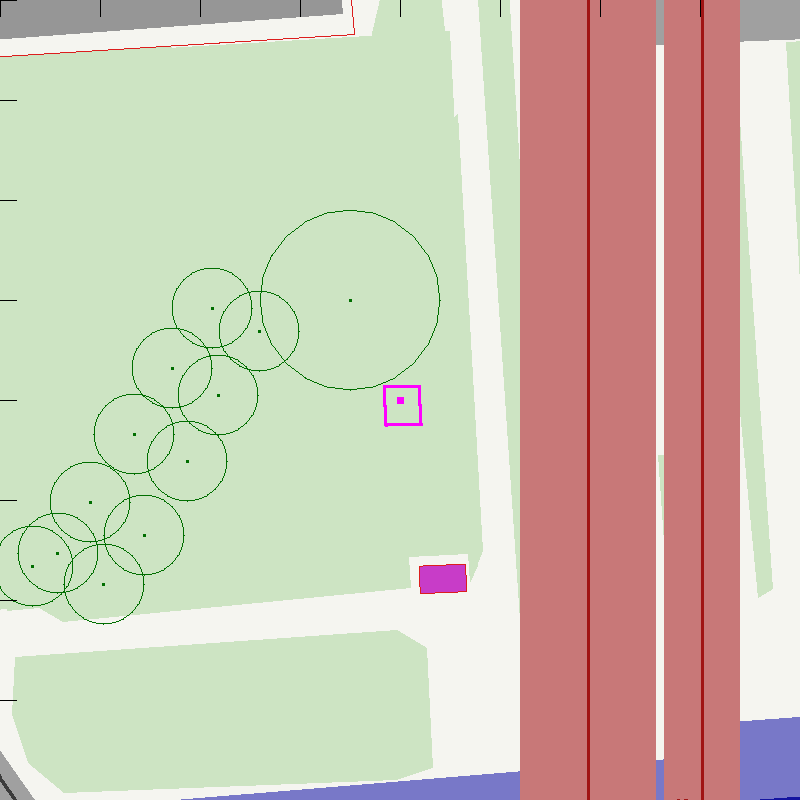

# 02 · Geometry: buildings, terrain, streets and trees

This chapter describes how the repo builds its 3D picture of the neighbourhood around the ZAGREB-1
air-quality station: `src/data/env.json`, the scene description that every other module reads, and
`src/data/lod2.bin`, the detailed display mesh. It covers the sources and licences, the coordinate
frame, each step of the pipeline, the parameters, the validation results and the known limitations.

> First draft by the geo-data owner (2026-09-27). Every number in the validation sections comes from
> `data/cache/validation/geometry_validation.json`, which `tools/build_env.py` writes on every run. The numbers below
> are those of the current `env.json` (generated 2026-09-28T07:26:42Z, after the frame fix of §2.3). The first build
> (2026-09-27T21:58:45Z, with the reference's compressed frame) had 4,304 buildings and 1,828 trees; chapters 03 and
> 07 quote some measurements made on it and say so.

---

## 2.0 Summary

| Item | Result |
|---|---|
| Buildings | **4,196** ZG3D 2022 LoD1 prisms (from 4,362 parts in the 1.5 km box) + **79** OSM fallback footprints = **4,275** |
| Source years of the ZG3D parts kept | 2008: 3,018 · **2022 (LiDAR + photo): 947 (22.6 %)** · 2019 (drone): 227 |
| Heights vs OSM `height` tags | n = 18, median bias **+0.45 m**, MAE **2.2 m** |
| Levels → height fit on ZG3D | H = **2.98·L + 5.84 m** (critic §1.9: 3.03·L + 5.81); rule used: 3.0·L + 5.5, MAE 3.2 m |
| Base heights vs DGU DTM | median **−0.08 m**, IQR −0.33…+0.09 m (3,878 ground-standing parts) |
| Frame check (OSM vs ZG3D footprints) | best shift **(0.0, −0.25) m** at 0.25 m resolution: the two layers are in the same frame |
| Motor-road centrelines over ZG3D roofs | 60 m of 36.3 km (**0.16 %**; bridges and building passages) |
| Terrain | ground **115.59 m** at the station; 107.75–119.61 m inside the box |
| Morphometry, 500 m disc (Macdonald 1998) | λp **0.234**, λf **0.181**, H̄ **14.3 m**, d **6.6 m**, z0 **1.49 m** (critic §1.10: 0.246, 0.193, 14.2, 6.8, 1.47) |
| Roads | 3,255 ways; group A 43, B 28 (incl. the orthophoto override), C 1,048, non-motor 2,136 |
| Trees | 1,807 (OSM nodes and tree rows + the station tree 14 m / r 9 m) |
| Heating area sources | 116 tiles of low-rise housing, 0.197 km², nearest 183 m from the station |
| `env.json` | **1.23 MB** (target < 1.5 MB) |
| `lod2.bin` | **72,810 triangles, 1.38 MB** within 500 m (budget ≈ 2.5 MB) |



*Figure 2.1: the 1.5 km box, north up. ZG3D parts are coloured by source year (grey 2008, blue 2019,
orange 2022); OSM fallback buildings are magenta. OSM building outlines are red, roads are black
(Vukovarska dark blue, Miramarska dark red), tram tracks green, trees dark green, heating tiles brown.
The tick marks are every 100 m.*

---

## 2.1 Purpose, inputs and outputs

The model needs the city as **solid obstacles**. The LBM wind tunnel (chapter 3) voxelises the
building prisms and the porous trees. The dispersion solver (chapter 4) needs the **sources**: road
centrelines with widths and traffic, and heating areas. The 3D view needs everything plus labels. All
of it comes from one file with one frame.

```
 ZG3D FeatureServer ──► tools/fetch_zg3d.py ──► data/cache/zg3d/raw/{lod2_*.json, fp_*.geojson}
 DGU RH_ELEV_107.tif ─► tools/fetch_dtm.py ───► data/cache/dtm/dtm_box.json (+ rows_*.bin)
 Overpass API ───────► tools/fetch_osm.py ───► data/cache/osm/{roads,rail,buildings,trees,landuse,pois,station}.json
                                                     │
                                                     ▼
                                          tools/build_env.py
                          ┌──────────────────────────┼──────────────────────────────┐
                          ▼                          ▼                              ▼
                 src/data/env.json         src/data/lod2.bin           data/cache/validation/
                 (architecture §4.1)       (architecture §4.1)         geometry_validation.json
                                                                        + docs/img/geo_*.png
```

- **Inputs:** three open web services (§2.2). The fetch scripts cache every raw answer under
  `data/cache/` (gitignored), so `build_env.py` runs offline and is reproducible.
- **Outputs:** `env.json` follows `docs/architecture.md` §4.1 exactly. The only representation
  choice beyond the schema is the keyhole ring for courtyards (§2.7.1). `lod2.bin` follows the binary
  layout of architecture §4.1.

---

## 2.2 Sources and licences

| Layer | Source | Licence / attribution | Used for |
|---|---|---|---|
| Buildings | City of Zagreb, **ZG3D 2022 3D model Grada Zagreba**, citywide ArcGIS FeatureServer `ZG3D_2022_3d_model_GZ` (data last edited 2025-03-10) | Otvorena dozvola (Croatian Open Licence, https://data.gov.hr/otvorena-dozvola). "© Grad Zagreb – ZG3D 2022 (3D model grada, LiDAR-ažuriran), Otvorena dozvola" | LoD1 prisms, LoD2 mesh, morphometry |
| Terrain | Državna geodetska uprava (DGU), **INSPIRE Elevation DTM**, tile `RH_ELEV_107.tif` (20 m, EPSG:3045) | Otvorena dozvola (DGU open data). "© DGU – INSPIRE digitalni model reljefa 20 m, Otvorena dozvola" | heights above local ground |
| Streets, trams, rail, trees, land use, names, POIs, fallback buildings | **OpenStreetMap** via the Overpass API | © OpenStreetMap contributors, **ODbL 1.0**. Everything in `env.json` derived from OSM stays under the ODbL, as in the reference repo | sources, display, fallback |
| Orthophoto check (not shipped) | City of Zagreb orthophoto 2022, 0.1 m WMS `Ortofoto2022_Public` | licence not stated (critic G5); used only as a build-time visual check | Miramarska carriageway override |

The attribution strings are in `env.meta.attribution` and are shown in the page footer
(architecture §7).

### 2.2.1 Why ZG3D, and what "LiDAR" means here

The user asked for a LiDAR-based model. The **raw national LiDAR** is not anonymously downloadable
(§2.2.2). ZG3D is the next best thing, and in practice better suited to a voxel model:

- It is a **LiDAR-updated 3D city model**. The City re-modelled the 2022 version against the
  2022 national LiDAR point cloud. In our box **22.6 % of the parts (947 of 4,192 kept) carry source
  "Multisenzorsko snimanje" (LiDAR + photogrammetry, 2022)**. 72 % are 2008 aerial
  photogrammetry and 5 % are 2019 drone surveys (critic G2, lidar-3d §3.2). The source year travels
  with every part (`buildings[].s`) and the UI can colour by it.
- It is LoD2.2 **building parts**, already split at height breaks. One LoD1 prism per part is
  therefore "LoD1.3", enough for 5 m voxels.
- It checks out against independent data (§2.9): 0.45 m median bias against OSM height tags, and
  base heights within 0.1 m of the DGU terrain.

### 2.2.2 The raw DGU LiDAR: request route and licence caveat

DGU flew the country in 2022/23 ("Multisenzorsko zračno snimanje RH", KK.05.2.1.10.0001):
≥ 8 pts/m² in urban areas, ±0.1 m vertical (68 %), classes 2 ground, 3–5 vegetation, 6 buildings.
The data are **free but on request**:

1. Fill in the form "ZAHTJEV – LIDAR PODACI" (dgu.gov.hr, *Podaci za ponovnu uporabu*) and email it to
   `izdavanje.podataka@dgu.hr`.
2. Ask, per 1:2000 sheet, for (a) classified LAS/LAZ, (b) the 1 m DMP (DSM) and (c) the 1 m DMR
   (DTM). The box needs the six sheets **2-491-105-9, 2-492-105-9, 2-516-105-9, 2-517-105-9,
   2-541-105-9 and 2-542-105-9** (lidar-3d §1).
3. **Licence caveat:** the LiDAR licence allows any use, but a public presentation must not let anyone
   "directly obtain the coordinate and height of an individual point or object" (lidar-3d §3.3). It
   is unclear whether per-building heights or voxel grids in a public repo would comply.
4. **Therefore:** keep raw DGU LiDAR in the gitignored `tools/private/` and use it only to validate
   or correct ZG3D locally (in particular the 2008 parts and the tree heights, critic G2/G8). Ask DGU
   before publishing anything derived from it. The research prototypes `laz_to_ndsm.py` and
   `osm_zonal_heights.py` (lidar-3d §5–6) show the processing.

---

## 2.3 The frame

Every layer goes through `tools/common.py:xz()` (architecture §2, critic §4.2):

    x = (lon − 15.97422) · 77 741.2        (east, m)
    z = −(lat − 45.800496) · 111 147.4     (south, m)

The two constants are the WGS84/GRS80 metres per degree at the origin latitude φ0 = 45.800496°:
`kx = N(φ0)·cos φ0·π/180` and `ky = M(φ0)·π/180`, where N and M are the prime-vertical and meridional radii of
curvature. The frame is therefore isometric (true metres in both directions) to about 0.01 % within the ±750 m scene.

The origin is the DHMZ station point. True north is −z, so meteorological bearings need no convergence
correction. Heights are metres above local ground (y). The model treats the ground as flat.

- **ZG3D is requested in lon/lat** (`outSR=4326`, `inSR=4326`) and pushed through the same `xz()`.
  This follows critic §4.2's rule never to mix EPSG:3765 offsets with the local frame. OSM is lon/lat anyway.
- The DTM lives in EPSG:3045. It is sampled by converting local (x, z) → lat/lon → EPSG:3045 (§2.5).

**The frame is consistent across layers.** An independent check (§2.9.4) finds the best match between OSM and
ZG3D footprints at a shift of (0.0, −0.25) m, i.e. within one 0.25 m raster cell of zero.

**History of the constants.** The first build used the reference repo's `kx = 111320·cos φ0 = 77 607.7` and
`ky = 110 540`. Those constants are the equatorial-sphere values, and they compress the map by 0.17 % east–west and
0.55 % north–south (1.3 m and 4.1 m at 750 m). That compression fully explains the 5–6 m disagreement with
EPSG:3765 offsets that critic §1.11 found. On 2026-09-28, during integration, the lead replaced them with the exact
ellipsoidal values above and rebuilt env.json from the cached downloads. Relative to Transverse Mercator
(point scale 0.99992 at the station), the remaining differences are the 0.37° grid convergence and a 0.008 % scale.

---

## 2.4 Step 1: ZG3D (`tools/fetch_zg3d.py`)

**Queries.** Two paged queries against `SITE.zg3d.feature_server`, both with the envelope of the
±750 m square in lon/lat (`common.bbox_latlon(750)`) and `orderByFields=OBJECTID`:

| Query | Options | Page | Raw cache | Result |
|---|---|---|---|---|
| 3D multipatch | `multipatchOption=embedMaterials&returnZ=true&outSR=4326&f=json` | 500 | `raw/lod2_<offset>.json` (9 pages, 9.2 MB) | `geometry.binaryPatches` per part |
| 2D footprints | `multipatchOption=xyFootprint&outSR=4326&f=geojson` | 2000 (= maxRecordCount) | `raw/fp_<offset>.geojson` (3 pages, 2.9 MB) | Polygon/MultiPolygon + attributes |

A `returnCountOnly` query checks completeness: **4,362 parts, and both queries returned 4,362**. The
count is 4,333 in lidar-3d §3.2, whose box was slightly smaller. The layer's `editingInfo` gives the
data date (2025-03-10). Without `multipatchOption` the server returns rings with z = 0
(lidar-3d §3.2 pitfall). The run takes about 23 s.

**Decoding `binaryPatches` (stdlib).** Base64 → a 12-byte header (`uint32` shape type 0xC0800036 =
GeneralMultiPatch|Z|M, `int32` uncompressed size, `int32` compressed size) → `zlib.decompress` → the
Esri extended shape buffer:

    int32 type | 4×double bbox | int32 nParts | int32 nPoints | int32 parts[nParts]
    | int32 partTypes[nParts] | 2·nPoints doubles (X, Y) | 2 doubles Z range | nPoints doubles Z | …

X/Y are lon/lat (the requested outSR) and Z is HVRS71 orthometric height. The part type is the low 4
bits of each type word: 0 TriangleStrip, 1 TriangleFan, 2 OuterRing, 3 InnerRing, 4 FirstRing, 5 Ring,
6 Triangles. In the box: **321,063 FirstRing, 47,858 OuterRing, 52 InnerRing, 24 TriangleFan**. The
decoder checks the uncompressed size against the header.

- Most "FirstRing" faces are **triangles stored as closed 5-point rings `[A, B, C, A, A]`**. About 108k
  are zero-area slivers `[A, B, B, A, A]`. The same pattern appears for the same features requested in
  EPSG:3765, so it is in the source, not a reprojection artefact.
- Hence the box holds about 320k real triangles, not the ~700k that lidar-3d §3.2 estimated from face
  counts.

---

## 2.5 Step 2: terrain (`tools/fetch_dtm.py`)

**The tile.** `RH_ELEV_107.tif`: 2074 × 2074 px, float64, uncompressed, **one row per strip**,
pixel 19.995 m, EPSG:3045, PixelIsArea, nodata −9999, 34 MB.

**Range reading (stdlib).**

1. Read the first 64 KB and parse the classic-TIFF IFD: ImageWidth/Length, BitsPerSample,
   Compression, SampleFormat, RowsPerStrip, StripOffsets/ByteCounts, ModelPixelScale,
   ModelTiepoint, GeoKeyDirectory (1025 raster type, 3072 EPSG) and GDAL_NODATA.
2. Project the edges of the ±750 m square to EPSG:3045 and find the pixel window. A margin of 3
   pixels gives rows 296–380 and columns 1097–1181 (85 × 85 px).
3. Read only the needed entries of the StripOffsets array. The strips are **contiguous**
   (offset[r] = offset[r0] + (r − r0)·16 592 B), so the 85 rows come in **one** Range request
   (1.4 MB, 0.3 s). The reader falls back to per-row requests, restricted to the column window, if a
   future tile is laid out differently.
4. Cache the raw rows (`rows_296_380.bin`). Write `dtm_box.json` with the native window (for exact
   bilinear sampling), a 20 m grid in the local frame (for display), the station value and the range.

**Map projection (stdlib, no pyproj).** EPSG:3765 (HTRS96/TM: λ0 = 16.5°, k0 = 0.9999) and
EPSG:3045 (UTM 33N: λ0 = 15°, k0 = 0.9996) are both Transverse Mercator on GRS80 with FE = 500 000 m.
`tm_forward` / `tm_inverse` implement Krüger's series to order n⁶ (Karney 2011, *J. Geodesy*
85:475, eqs. 35–36). With n = f/(2 − f), A = a/(1 + n)·(1 + n²/4 + n⁴/64 + n⁶/256):

    t  = sinh(atanh(sin φ) − e·atanh(e·sin φ)),   ξ' = atan2(t, cos Δλ),   η' = atanh(sin Δλ / √(1 + t²))
    ξ  = ξ' + Σ αj sin(2jξ') cosh(2jη'),           η  = η' + Σ αj cos(2jξ') sinh(2jη')
    E  = FE + k0·A·η,                             N  = FN + k0·A·ξ

The inverse uses the β series and the δ series (conformal → geodetic latitude). WGS84 lat/lon is
treated as ETRS89 (< 1 m; the same null transformation ArcGIS and pyproj apply).

| Check | Result |
|---|---|
| DHMZ point → EPSG:3765 | E 459 129.3182, N 5 073 538.2343 (lidar-3d §1: 459 129.318, 5 073 538.234) |
| DHMZ point → EPSG:3045 | E 575 706.671, N 5 072 343.072 (lidar-3d §1: 575 706.67, 5 072 343.07) |
| Round trip, 42.4–46.5° N × 13.5–19.4° E | < 1e-10° |
| Central meridian vs numerically integrated meridian arc | < 1 mm |
| Ground at the station (bilinear) | **115.59 m** (research: 115.58 m nearest-pixel, 115.6 m) |
| Range, whole window (incl. margin) | **107.75–121.56 m** (research: 107.75–121.56 m) |
| Range, pixels inside the ±750 m square | 107.75–119.61 m (the 121.56 m pixel lies at x = −817 m) |

**Sampling.** `DTM.at(x, z)` converts local → lat/lon → EPSG:3045 and interpolates the native window
bilinearly, ignoring nodata neighbours.

---

## 2.6 Step 3: OpenStreetMap (`tools/fetch_osm.py`)

Seven Overpass queries, over the box plus 50 m so that edge features come complete, one at a time with a
2 s pause:

| Layer | Query (abridged) | Elements (2026-09-27) |
|---|---|---|
| `roads` | `way["highway"]` | 3,653 |
| `rail` | `way["railway"]` | 205 |
| `buildings` | `way/relation["building"]`, `["building:part"]` | 2,243 |
| `trees` | `node["natural"="tree"]`, `way["natural"="tree_row"]` | 2,375 |
| `landuse` | landuse, leisure, natural (not trees), waterway, water, parking, `area:highway`, pedestrian areas, squares | 1,596 |
| `pois` | schools, kindergartens, hospitals, clinics, fuel, named landmarks (`out center`) | 371 |
| `station` | `way(1409603653)` + monitoring stations within 300 m | 2 |

- **User-Agent** from `common.USER_AGENT`: overpass-api.de answers HTTP 406 without one (lidar-3d §3.1).
- **Fallback endpoint:** `SITE.overpass[1]` (overpass.kumi.systems) when the main server fails.
- **Staleness:** the base timestamp `osm3s.timestamp_osm_base` is stored per layer in
  `data/cache/osm/fetch_meta.json`. A warning is logged when it is more than 30 days old.
  - During this build the POI query first fell back to kumi, which served data from 2026-05-06
    (145 days old; site-context §11 saw the same). It was re-fetched from the main server.
  - All layers in the committed `env.json` are from base **2026-09-27T21:25Z** (overpass-api.de).

---

## 2.7 Step 4: `tools/build_env.py`

About 40 s end to end, 0.6 GB peak memory, no network.

### 2.7.1 Buildings

**ZG3D parts → LoD1 prisms** (critic §4.3 step 1, lidar-3d §4). For every footprint polygon of
every part:

    g = DTM(centroid)                        (area-weighted centroid of the RDP-simplified outer ring)
    h = Z_Max − g                            (top above local ground)
    b = max(0, Z_Min − g);  b = 0 if b < 1 m (base; > 0 only for parts that float: roof superstructures,
                                              tower tops, bridges)

| Filter | Parts |
|---|---|
| Raw parts in the box | 4,362 |
| Bad Z (Z_Min or Z_Max ≤ 0; lidar-3d §3.2) | 1 |
| Centroid outside the ±750 m square | 97 |
| Outer ring degenerate after RDP 0.6 m, or area < 1 m² | 22 |
| h < 1 m | 46 |
| Thinner than 0.2 m after rounding (sheets) | 5 |
| **Kept** | **4,192 parts = 4,196 prisms** (MultiPolygon parts give one prism per polygon) |

Of the kept prisms, 395 float (b ≥ 1 m). Heights: median 5.5 m, p95 24.4 m, max 97.9 m (Eurotower). The
exact frame (§2.3) makes the ±750 m square 0.17 %/0.55 % smaller in degrees than the first build's, so 30 more
parts fall outside it.

- **Courtyards (holes).** The schema has one ring per prism. 73 holes ≥ 4 m² are therefore joined to
  their outer ring by zero-width bridges, making a *keyhole ring*. The bridges are the same as the
  triangulator's (§2.7.8).
  - With the even-odd rule (core.js `pointInPoly`, every scanline voxeliser) the courtyard stays open,
    and the shoelace area is outer minus holes.
  - `THREE.Shape`/earcut extrudes keyhole rings correctly. This was checked in a headless render.
  - Smaller holes (light wells < 2 × 2 m) are filled.
- **Ids.** `"zg3d:<OBJECTID>"`, or `"zg3d:<OBJECTID>.<k>"` for the k-th polygon of a MultiPolygon.
  OBJECTID is the service's stable key, which scenarios use to remove buildings.
- `s` = `Godina_izv` (2008 / 2019 / 2022), `k = "zg3d"`.

**OSM fallback** (critic §1.9, §4.3 step 2). An OSM `building` footprint is added when the share of
its 1 m cells covered by *any* ZG3D footprint (roof cover) is below 0.5. The cover mask includes the
parts dropped above, so buildings at the box edge are not mistaken for missing ones.

- 1,813 OSM buildings are in the box and 1,734 are covered. **79 are added**, 57 of them smaller than
  60 m² (kiosks, sheds, shelters, bus-station roofs).
- Excluded: `building=no`; construction sites without height or levels; **the station container**
  (OSM way 1409603653). The container is not in ZG3D either: no nDSM cell within 39.9 m of the origin
  (critic §1.6). It goes to `station.container` and never enters the flow (critic §4.2).
- Height rules, in order:

| Rule | h | Source |
|---|---|---|
| `height` tag | the tag | OSM |
| `building=roof` (canopy) | 5 m, with b = h − 1 m (a slab the flow passes under) | judgement |
| footprint < 60 m² | 3 m per level (1 level if untagged), no roof term | the 5.5 m intercept of the critic §1.9 fit comes from pitched roofs and tall ground floors of ordinary buildings |
| `building:levels` = L | **3.0·L + 5.5 m** | critic §1.9 (fit to ZG3D p90 roofs) |
| type default | house/detached 7 m, apartments/residential/office 14.3 m, school 12 m, university 14 m, church/hospital 18 m, commercial/retail 10 m, industrial/warehouse 9 m, garage/shed/kiosk 3 m | site-context §4.3, §9.1; reference `extract_env.py` |
| untagged `yes` | 14.3 m (4 storeys) | site-context §4.3 |

`min_height` or `building:min_level` sets b. OSM fallback prisms have `s = 0`, `k = "osm"` and
`id = "osm:w<way>"` or `"osm:r<relation>"`.

### 2.7.2 Roads

Every `highway=*` way, clipped to the box and simplified by RDP (0.5 m for classes 0–2, 1.0 m
otherwise). `area=yes` highways go to `paved` instead.

| Field | Rule |
|---|---|
| `c` | 0 motorway/trunk/primary(+_link) · 1 secondary(+_link) · 2 tertiary(+_link) · 3 residential, unclassified, living_street, road · 4 service, busway · 5 footway, cycleway, pedestrian, path, steps, track, bridleway (architecture §4.1). Construction, proposed, platforms and corridors are skipped |
| `o` | `oneway=yes/true/1` → 1, `-1/reverse` → −1, roundabouts → 1, else 0 |
| `l` | the `lanes` tag (max of `a;b`), else by class for a two-way way: 4 (classes 0–1), 2 (2–3), 1 (4). Halved (min 1) when one-way. 0 for non-motor ways |
| `w` | l × 3.25 m (architecture §4.1). Non-motor: the `width` tag if 0.5–20 m, else footway/cycleway/steps 2 m, path 1.5 m, pedestrian 6 m (display only) |
| `g` | "A" `name = Ulica grada Vukovara`; "B" `name ∈ {Miramarska cesta, Miramarski podvožnjak}` (the underpass is the southbound carriageway of Miramarska N); "C" every other motor road; null for c = 5 |
| `aadt` | below; 0 when g is null |

**AADT** (veh/day carried by *this* way; critic §4.6, site-context §3.2–3.3). There are no public
counts (critic G1): these are model defaults that the UI exposes as sliders.

| Link | AADT of the link | Rule for splitting |
|---|---|---|
| Vukovarska W / E | 47 000 / 45 000 | split at the Miramarska axis x = 25 m (critic §1.6 carriageways at +12…+34 m) |
| Miramarska N / S | 20 000 / 12 000 | split at the Vukovarska median z = 53 m (site-context §3.1: z 42–65 m) |
| Miramarska N one-way carriageways | 60 % southbound / 40 % northbound | critic §4.6 (4 vs 2 lanes); direction from the way's geometry and `oneway` |
| Trg S. Radića, HBZ, Lučića, Savska, Slavonska, Branimirova | 4 000, 50 000, 12 000, 45 000, 40 000, 25 000 | critic §4.6 |
| Class defaults | secondary 25 000 · tertiary 12 000 · unclassified 3 000 · residential/living_street 1 000 · service 150 · primary 45 000 · trunk 60 000 | critic §4.6, site-context §3.3 |
| One-way carriageway | 50 % of the link | critic §4.6 |
| `*_link` slips | 25 % of the class default (6 250 for secondary_link) | judgement: one turning movement; no counts (G1) |

Result: A 43 ways (22,500 or 23,500 each: every Vukovarska way is one carriageway), B 28 ways, C 1,048.
Traffic-weighted length (veh·km/day inside the box): A 69,253, B 31,350, C 215,769. The AADT defaults are also
listed, by link, in [05 Emissions](05-emissions.md) §3, which turns them into source strengths.

**Carriageway override at the station** (critic §1.6, §4.3 step 4). The 0.1 m city orthophoto 2022
(research `critic/zg_orto2022_80m_marked.jpg`) shows, east of the station:

- the footway and cycle strip at +6.5 to +9 m;
- the west kerb at +12 m;
- the southbound carriageway at **+12 to +25.5 m** (4 lanes);
- a median;
- the northbound carriageway at **+26.5 to +34 m** (2 lanes).

OSM places the southbound centreline at x = 22.75 m (at z = 0), **4.00 m east of the true centre**
(18.75 m). The northbound centreline is at 28.49 m, 1.76 m west of the true centre (30.25 m). North of
z = −10 m OSM also merges both carriageways into one 6-lane way. (These are the values in the exact frame; the
first build's compressed frame gave 22.71 m and 28.44 m.)

- Within |z| ≤ 40 m (the verified extent) and 5 < x < 45 m, the OSM Miramarska geometry is cut out
  (133.9 m of centreline from ways 949828012, 195556406 and 924732206).
- It is replaced by two carriageways:
  - southbound: x = 18.75 m (stored 18.8), w = 13.5 m, 4 lanes, drawn north → south, AADT 12 000;
  - northbound: x = 30.25 m (stored 30.2), w = 7.5 m, 2 lanes, drawn south → north, AADT 8 000.
- Beyond ±40 m the OSM centrelines and lanes × 3.25 m are kept.
- An overlay of all env.json layers on the orthophoto crops (80 m at 0.1 m/px and 300 m at 0.5 m/px),
  done with a scratch script at build time, shows these checks:
  - both carriageway bands fall on the kerbs and the median;
  - the Vukovarska carriageway edges fall on its kerbs;
  - the tram tracks lie in the Vukovarska median;
  - the ZG3D footprints sit on the roofs.



*Figure 2.2: ±100 m around the station, carriageway bands drawn at their width w (Vukovarska blue,
Miramarska red, others grey), trees as crown circles of radius r, the station and its container in
magenta. The southbound and northbound bands between z = −40 and +40 m are the orthophoto override.*



*Figure 2.3: ±40 m (the extent of the 0.1 m orthophoto crop). Ticks every 10 m. The big crown NW of
the inlet is the station tree; the kiosk south of the station ("iNovine", an OSM fallback, 3 m) is
visible in the orthophoto.*

### 2.7.3 Trees

- **OSM trees.** `natural=tree` nodes (2,362) take h = 12 m and r = 4 m (critic §4.3), unless a
  plausible `height` (2–45 m, 10 trees) or `diameter_crown` tag exists.
- **Tree rows.** `natural=tree_row` ways (13) are sampled every 8 m (86 trees).
- **Dropped:**
  - 66 trees whose position lies inside a ZG3D footprint (they would sit inside a solid);
  - 3 inside the station tree's crown (the same tree).
- **The station tree** `{x: −5, z: −10, h: 14, r: 9, k: "station"}` (critic §1.6: 18 m crown about 5 m W
  and 10 m N of the inlet; G8: 14 m by default, since the Meta CHM reads only 7.6 m). It is also in
  `station.tree`.
- Total **1,807** (the ±750 m square of the exact frame is slightly smaller than the first build's, §2.3).
  CHM trees (`k: "chm"`) are not produced: the Meta CHM needs a raster library and
  under-reads the station tree (critic D15, G8).

### 2.7.4 Tram, rail, green, water, paved

| Layer | Content | Count |
|---|---|---|
| `tram` | `railway=tram` incl. sidings, clipped, RDP 1 m | 38 |
| `rail` | `railway=rail/light_rail` incl. yard, siding, spur (not disused, abandoned, razed, platforms) | 97 |
| `green` | leisure park/garden, landuse grass/recreation_ground/village_green/meadow/forest/flowerbed/allotments/cemetery, natural wood/scrub/grassland/heath | 799 |
| `water` | natural=water, landuse basin/reservoir, fountains, swimming pools | 29 |
| `paved` | surface parking, `area:highway`, pedestrian areas, squares | 317 |

Polygons are RDP-simplified at 1 m and clipped to the box (Sutherland–Hodgman). Holes are ignored for
these display layers.

### 2.7.5 Heating area sources

Domestic heating is group D (architecture §5.3, critic §4.6: `landuse=residential` with
house/detached buildings, low-rise). The confidence is low (critic G14).

1. **Candidates.** `landuse=residential` polygons (37) with at least one OSM
   house/detached/semidetached/bungalow/terrace building, or with a low-rise share ≥ 0.5.
   - Low-rise means a ground-standing prism with h ≤ 11.5 m (3.0 × 2 + 5.5, i.e. at most two storeys by
     critic §1.9) and a footprint ≥ 30 m².
   - Smaller footprints are sheds and garages, not heated dwellings.
   - 20 polygons qualify.
2. **Tiles.** Each candidate is cut into 50 m tiles aligned to the origin (a Trnje house block, 10 LBM
   cells). A tile is kept if it holds ≥ 150 m² of low-rise footprint, i.e. at least one house.
   - Why tiles: one OSM residential polygon of 0.11 km² reaches from Martinovka down to the station.
   - Spreading its heating evenly would put a heating source next to the inlet, over a park and a
     9-storey slab.
   - With tiles, the nearest heating area is **183 m** from the station.
3. **Weight.**

       w = λp,low(tile) / λp,low,ref,   λp,low,ref = Σ low-rise footprint / Σ tile area = 0.368,   capped at 3

   - The area-weighted mean of w over the heating area is therefore 1. The q_D of
     `groupStrengths()` (emissions.js) is the **mean** areal rate over that area.
   - Denser house quarters emit proportionally more. Households give 74 % of city PM10, and 99 % of that
     comes from wood (site-context §6).
   - w ranges 0.22–3.0 (the cap; median 1.0).

Result: **116 tiles, 0.197 km²**. Most lie in Trnje S/SE of the station (150–700 m, as critic §4.6
expects) and in the Martinovka house quarter NW.

### 2.7.6 POIs, labels, station

- **`pois`** (14: 6 schools, 5 kindergartens, 1 hospital, 2 fuel stations):
  `amenity=school/kindergarten/fuel/hospital` (and `healthcare=hospital`, or clinics named "bolnica"). Name, else
  brand or operator. De-duplicated within 20 m.
- **`labels`** (50: 24 roads, 14 parks, 12 landmarks and POIs):
  - Roads:
    - "Vukovarska" twice (x = −170 and +230 m), placed on the median between the two carriageways;
    - "Miramarska" twice (z = −150 and +190 m);
    - every other named road of class ≤ 2, plus Trg Stjepana Radića, with ≥ 150 m in the box, at the
      midpoint of its longest piece.
  - Named parks and gardens (Park Drage Galića, Park Stjepana Srkulja, Botanički vrt, …) at their
    centroids.
  - Landmarks from a curated name list: Lisinski, Glavni kolodvor, Hotel International, Eurotower,
    Eurocentar, FER, NSK, Hotel Esplanade, Paromlin, Palača pravde, Gradska uprava, Filozofski
    fakultet.
  - The Vjesnik tower (Slavonska avenija 4) stands just beyond the box's south-west corner. It is
    not in the box extract and gets no label; the name list would pick it up if the box grew.
  - Names are proper nouns and are not translated.
- **`station`**:
  - `{x: 0, z: 0, inlet: 4.0}` (critic §1.6: EEA inlet height 4 m).
  - `container`: the OSM way 1409603653 footprint (3.5 × 3.8 m). A 3 × 2.4 m rectangle is the fallback.
  - `tree`: as in §2.7.3.

### 2.7.7 Morphometry (`morph`)

The inflow profile (physics §6.3) and the stability closure need the upstream roughness. It is computed
as in critic §1.10:

1. **nDSM.** Every LoD2 roof face (|n_y|/|n| ≥ 0.1, as the research `zg3d_to_ndsm.py`) is rasterised at
   1 m over the whole box. Each cell keeps the maximum roof height above local ground. The ground is the
   same DTM(centroid) as the prism's (131,745 roof triangles, 9 s).
2. **Region statistics** for a disc, or for the upwind 90° wedge (bearing ±45° of the wind-from direction,
   r ≤ 600 m). The raster is sampled on a 1 m lattice aligned with the wind (nearest neighbour):
   - λp = share of cells with nDSM ≥ 2 m;
   - H̄ = mean nDSM over those cells (area-weighted);
   - λf = Σ (positive height steps met walking downwind) × 1 m / region area.
3. **Macdonald, Griffiths & Hall (1998)**, with A = 4.43, β = 1.0, C_D = 1.2, κ = 0.4 (critic §1.10):

       d/H̄  = 1 + A^(−λp) (λp − 1)
       z0/H̄ = (1 − d/H̄) · exp{ −[0.5 β (C_D/κ²) (1 − d/H̄) λf]^(−1/2) }

   The headline values use the 500 m disc with λf averaged over 16 directions (range 0.151–0.201).

| Region | λp | H̄ (m) | λf | d (m) | z0 (m) | critic §1.10 (λp, H̄, λf, d, z0) |
|---|---|---|---|---|---|---|
| Disc r = 500 m | **0.234** | **14.3** | **0.181** | **6.6** | **1.49** | 0.246, 14.2, 0.193, 6.8, 1.47 |
| Disc r = 300 m | 0.257 | 16.3 | 0.202 | 8.0 | 1.64 | 0.267, 16.3, 0.218, 8.3, 1.66 |

Upwind wedges (`morph.sectors`, `from` = wind-from bearing):

| From | 0 | 45 | 90 | 135 | 180 | 225 | 270 | 315 |
|---|---|---|---|---|---|---|---|---|
| λp | 0.208 | 0.206 | 0.175 | 0.226 | 0.294 | 0.270 | 0.276 | 0.252 |
| critic | 0.22 | 0.22 | 0.18 | 0.24 | 0.31 | 0.28 | 0.29 | 0.26 |
| H̄ (m) | 12.8 | 14.3 | 13.1 | 12.6 | 14.0 | 15.8 | 14.7 | 12.2 |
| critic | 12.8 | 14.3 | 13.0 | 12.5 | 14.0 | 15.8 | 14.7 | 12.1 |
| λf | 0.143 | 0.176 | 0.095 | 0.162 | 0.177 | 0.239 | 0.189 | 0.215 |
| critic | 0.17 | 0.19 | 0.11 | 0.18 | 0.21 | 0.26 | 0.20 | 0.24 |
| d (m) | 5.4 | 5.9 | 4.8 | 5.7 | 7.6 | 8.1 | 7.6 | 5.9 |
| critic | 5.6 | 6.2 | 4.9 | 5.8 | 7.8 | 8.3 | 7.9 | 6.1 |
| z0 (m) | 1.24 | 1.67 | 1.02 | 1.24 | 1.03 | 1.70 | 1.27 | 1.33 |
| critic | 1.35 | 1.70 | 1.07 | 1.28 | 1.13 | 1.73 | 1.26 | 1.34 |

- **Agreement.** λp is within 0.016, H̄ within 0.1 m, d within 0.3 m and z0 within 0.11 m of the
  critic's independent raster (EPSG:3765, 1 m).
- **λf** is systematically lower: 6 % for the 500 m disc, 5–16 % per wedge. The two samplers differ:
  nearest-neighbour on a wind-aligned lattice here, against a rotated raster in the critic's run. The critic
  notes that its approach inflates diagonal directions.
- **Direction dependence.** λf still depends on direction (lower along the N–S/E–W street grid, higher
  for diagonal winds, as projected frontal areas should).
- **LoD1 comparison.** The same statistics on the LoD1 prisms (top = Z_Max for the whole part) give
  H̄ = 17.8 m, d = 8.3 m and z0 = 1.90 m. LoD1 overstates pitched and stepped roofs. The LoD2 nDSM
  values describe the real upstream city and are the ones in `env.json`.

### 2.7.8 The LoD2 display mesh (`lod2.bin`)

**Selection.** Parts whose vertex centroid is within 500 m of the station (`SITE.extent.lod2_radius_m`,
critic §4.3) and that were kept as LoD1: 1,031 parts.

**Triangulation** (`fetch_zg3d.triangulate_patches`, stdlib):

- TriangleStrip `(v_i, v_i+1, v_i+2)` with alternating winding restored.
- TriangleFan `(v_0, v_i, v_i+1)`.
- Triangles: consecutive triples.
- Polygons: an OuterRing and its following InnerRings, or a FirstRing and its following Rings, form
  one polygon with holes. It is triangulated by `triangulate_polygon_3d`:
  1. **Best-fit plane:** the Newell normal of the outer ring picks the axis to drop. The polygon is
     projected onto the other two axes and mirrored if needed so that the projection is
     counter-clockwise.
  2. **Holes → bridges** (Eberly 2008, *Triangulation by ear clipping*, §3). Take the right-most
     vertex M of each hole, cast a ray towards +x, and find the nearest crossed edge and its right-most
     end point P. If a reflex vertex lies inside triangle (M, hit, P), use the one closest in angle
     instead. When P already occurs several times (after earlier bridges), the copy whose interior
     wedge contains the direction to M is used, so successive bridges nest (as earcut's
     *sectorContainsSector*).
  3. **Ear clipping**, O(n²). A convex vertex is an ear if no other vertex lies inside *or on* its
     triangle. The on-boundary test matters when hole edges and bridges are collinear. Collinear and
     duplicate vertices are dropped. A degenerate remainder clips its most convex vertex, so the loop
     always ends.

**Heights and orientation.**

- Vertices are placed at y = Z − g, using the part's own DTM(centroid). For ground-standing parts
  (b = 0) the lowest vertices are set to y = 0, so walls neither float nor sink.
- Bottom faces (all three vertices at y ≤ 0.05 m, 5,311 of them) are dropped.
- Esri rings are clockwise seen from outside. **991 of 1,031 parts** have a negative signed volume in
  the right-handed (x, y, z) frame and are flipped. Every part then satisfies (b − a) × (c − a) pointing
  outward, which is the three.js front face.

**Binary** (architecture §4.1, little-endian):

- header `"ZL2B"`, `uint32` 1, `uint32` nTri, `uint32` 0;
- `Int16` positions in decimetres [nTri × 9];
- `Uint8` class = source year − 2000 [nTri];
- zero padding to a multiple of 4.

**Result: 72,810 triangles, 1,383,408 bytes**, no clamped coordinate (the first build: 73,469 triangles).
A headless three.js render (`FrontSide`, `computeVertexNormals`) shows correctly shaded roofs and walls,
and LoD2 and LoD1 agree in position and height.

### 2.7.9 `meta` and the size budget

`meta` carries:

- `generated_utc` and `frame` (a copy of `SITE.frame`);
- `extent`;
- `sources`:
  - `zg3d`: fetch time, prisms used, service count, data edit date, URL;
  - `osm`: fetch time, base timestamp, endpoints, number of fallback buildings;
  - `dtm`: fetch time, URL, CRS, station ground, range;
- `attribution`: the three strings;
- `notes`: the keyhole rings, the override and the AADT caveat.

Size by key: buildings 649 KB, roads 371 KB, trees 82 KB, green 80 KB, paved 25 KB, heating 9 KB,
others < 5 KB each. **Total 1.23 MB.** Coordinates are rounded to 0.1 m and whole numbers are
written without ".0".

---

## 2.8 Parameters

| Parameter | Value | Source / reason |
|---|---|---|
| Scene half-size | 750 m | `SITE.extent.scene_half_m` (critic §4.2) |
| LoD2 radius | 500 m | `SITE.extent.lod2_radius_m` (critic §4.3, lidar-3d §3.2) |
| Footprint RDP | 0.6 m | architecture §4.1, critic §4.3 |
| Road RDP | 0.5 m (c ≤ 2), 1.0 m | below the 5 m LBM cell; display |
| Area-layer RDP | 1.0 m | display |
| Minimum height, base threshold | 1 m, 1 m | critic §4.3 |
| Minimum part area, hole area, thickness | 1 m², 4 m², 0.2 m | below any LBM cell; light wells; sheets |
| ZG3D cover threshold for OSM fallback | 0.5 | critic §1.9, §4.3 |
| Levels → height | 3.0·L + 5.5 m | critic §1.9 |
| Small-structure threshold | 60 m², 3 m per level | judgement (kiosks, sheds) |
| Lane width | 3.25 m | architecture §4.1 |
| OSM tree defaults | h 12 m, r 4 m | critic §4.3 |
| Tree-row spacing | 8 m | brief (two 4 m crowns) |
| Station tree | (−5, −10), h 14 m, r 9 m | critic §1.6, G8 |
| Miramarska override | SB x +12…+25.5 m, NB +26.5…+34 m, \|z\| ≤ 40 m | critic §1.6 (orthophoto 2022) |
| AADT | table in §2.7.2 | critic §4.6, site-context §3.2–3.3 |
| Link fraction | 0.25 | judgement (G1) |
| Low-rise height, dwelling footprint | 11.5 m, 30 m² | critic §1.9 formula at 2 levels; judgement |
| Heating tile, minimum low-rise per tile, weight cap | 50 m, 150 m², 3 | judgement (house block; one house) |
| Roof-face threshold, building nDSM | \|n_y\|/\|n\| ≥ 0.1, ≥ 2 m | research `zg3d_to_ndsm.py`, critic §1.10 |
| Macdonald constants | A 4.43, β 1.0, C_D 1.2, κ 0.4 | critic §1.10, Macdonald et al. 1998 |
| Morphometry regions | disc 500 m (and 300 m); 90° wedges, r ≤ 600 m | critic §1.10 |

---

## 2.9 Validation

All numbers are recomputed on every build (`data/cache/validation/geometry_validation.json`).

### 2.9.1 ZG3D heights against OSM tags

Method: for each OSM building with ZG3D roof cover ≥ 0.8, take the p90 of the LoD2 nDSM inside the OSM
footprint (lidar-3d §3.2, critic §1.9).

| Comparison | n | Result | Research value |
|---|---|---|---|
| OSM `height` tag | 18 | median bias (ZG3D − tag) **+0.45 m**, MAE **2.15 m** | n = 21, +0.2 m, 2.1 m |
| Worst cases | | 29 → 42.3 m, 22 → 31.6 m, 50 → 53.5 m | the same two outliers (likely eave heights or out-of-date tags) |
| `building:levels` (no height tag), least-squares fit | 291 | H = **2.98·L + 5.84 m**, MAE 3.18 m | 302, 3.03·L + 5.81, MAE 3.1 |
| Rule 3.0·L + 5.5 m | 291 | MAE 3.19 m, median bias −0.26 m | — |
| Reference rule 3.1·L + 1.5 m | 291 | MAE 4.45 m | 4.5 m |
| Median H / L | 291 | 4.81 m per level | 4.79 |

### 2.9.2 Base heights

Z_Min − DTM(centroid) for all 4,247 parts that passed the Z and area filters:

| Subset | n | Median | IQR | p5 | p95 |
|---|---|---|---|---|---|
| Ground-standing (< 3 m) | 3,878 | **−0.08 m** | −0.33…+0.09 m | −0.96 m | +0.48 m |
| All | 4,247 | −0.05 m | −0.30…+0.16 m | −0.90 m | +11.6 m |

The research value (lidar-3d §3.2) is −0.06 m median with IQR −0.28…+0.10 m for 3,907 ground-standing
parts. ZG3D and the DGU DTM are both HVRS71 and agree to about 0.1 m. 400 parts have a base ≥ 1 m
(369 > 3 m; the research found 374).

### 2.9.3 Parts by source year

| Source year (`Godina_izv`) | Izvor | In the box | Kept | Share kept |
|---|---|---|---|---|
| 2008 | aerofotogrametrijsko snimanje | 3,151 | 3,018 | 72.0 % |
| 2022 | Multisenzorsko snimanje (LiDAR + photo) | 978 | 947 | **22.6 %** |
| 2019 | Dron snimanje 2019 / bespilotna letjelica | 233 | 227 | 5.4 % |

### 2.9.4 Alignment in the local frame

- **Footprints.** The ZG3D footprint mask (ground-standing prisms) and the OSM building mask are
  rasterised at 0.25 m within ±300 m. The overlap (IoU) is computed for every shift of the OSM mask
  within ±3 m (625 shifts, rows as Python big-integer bit sets).
  - IoU 0.600 at zero shift, best 0.602 at **(dx, dz) = (0.0, −0.25) m**. The layers agree to one
    raster cell.
  - The IoU is below 1 because OSM and ZG3D delineate buildings differently: parts vs whole
    buildings, and roof overhangs.
- **Roads vs roofs.** 60 m of 36.28 km of motor-road centreline (c ≤ 3) runs over ZG3D roofs
  (0.16 %). These are short passages under buildings or canopies: Trg Stjepana Radića at
  (238, −86), the Miramarski podvožnjak at (−10, −451), and two residential streets at the box edge.
  A frame offset of even a few metres would put several percent of the avenues under buildings.
- **Orthophoto.** See §2.7.2 and Figures 2.2–2.3. The OSM southbound Miramarska centreline is 4.00 m
  east of the carriageway centre (the critic estimated about 3 m).
- **3D render.** LoD1 and LoD2 were drawn together in headless three.js from the same camera. Positions,
  heights and courtyards agree.

### 2.9.5 Triangulator

- **Unit tests** (concave L, comb, star, collinear and duplicate points, one to three holes including
  nested bridges, a concave outer ring with holes, 4 planes × 2 orientations): area is conserved to
  1e-6.
- **Randomised.** 2,400 cases (1–8 holes, some collinear) with zero failures.
- **All 368,921 ZG3D faces in the box.** Total triangle area differs from the Newell ring areas by
  **7.7e-5**. 14 faces (non-planar rings) differ by more than 5 %.

---

## 2.10 Limitations

- **ZG3D epoch.** 72 % of the parts are the 2008 model. The City re-modelled against the 2022 LiDAR, but
  it is unclear whether the 2008 parts were checked or just kept (lidar-3d §8.2). New buildings since
  2022 appear only if OSM has them (the 79 fallbacks). Buildings demolished since 2008 may remain.
- **LoD1 = Z_Max per part.** Pitched roofs become boxes as high as the ridge. That is fine for 5 m
  voxels, but it makes the LoD1 city about 3.5 m "higher" on average than the nDSM (§2.7.7).
- **Keyhole rings** are a schema-preserving trick. A consumer that simplifies or offsets rings (for
  example, an outline shader) sees the zero-width bridge as a double edge.
- **Trees.**
  - Heights and crowns are defaults (12 m / 4 m) for all but 10 tagged trees.
  - The OSM tree line along the diagonal path of Park Drage Galića, 15–40 m W and SW of the inlet,
    is not visible on the 2022 orthophoto. The trees were probably planted later (their node ids are recent),
    so the defaults overstate them.
  - No CHM trees, and no hedges.
- **Roads.**
  - AADT are defaults with ±25–40 % uncertainty (critic G1).
  - Widths away from the station are lanes × 3.25 m from OSM `lanes`. Where the tag is missing the
    class default is used.
  - Links get a judgement fraction (0.25).
  - The override is checked only within ±40 m.
- **Heating** tiles depend on OSM `landuse=residential` coverage and on the low-rise heuristic. The weight
  is relative to the heating area. Rates are order-of-magnitude only (critic G14).
- **Frame.** Since 2026-09-28 the local frame uses the exact WGS84 metres per degree and is isometric to about
  0.01 % within the scene (§2.3). The first build's frame was 0.17 % (E–W) and 0.55 % (N–S) short of true metres;
  the first 10 m LUT and its calibration were computed on that geometry (docs/07 §11.1). The embedded 5 m LUT and the
  current calibration use the exact frame (docs/07 §11.2). The remaining
  approximation is the flat ground (the terrain varies by 14 m over the box).
- **OSM staleness.** The fallback Overpass mirror can be months old. The fetch meta records it.
- **Service stability.** The ArcGIS item may be renamed with the next ZG3D release (lidar-3d §8.3). The
  committed `env.json` and `lod2.bin` keep the app working. Fallback F1 is the district shapefiles on
  data.zagreb.hr (lidar-3d §4).

---

## 2.11 How to re-run

```bash
python3 tools/fetch_osm.py        # ~1–3 min (Overpass; retries on 429/504); --refresh to re-fetch, --only roads
python3 tools/fetch_zg3d.py       # ~25 s, 13.5 MB of raw pages; --refresh
python3 tools/fetch_dtm.py        # < 1 s, 1.4 MB range read; --refresh, or --file RH_ELEV_107.tif
python3 tools/build_env.py        # ~40 s, offline; --no-lod2, --no-plots
python3 tools/build.py            # page
python3 -m unittest discover -s tests/python -p 'test_geometry.py' -v
```

Or all four data steps: `make geometry`. Every fetch script reuses its cache unless `--refresh` is
given. `build_env.py` never touches the network. After a refresh:

1. Check the log for "stale mirror" warnings and for count mismatches.
2. Compare `geometry_validation.json` with the numbers in this chapter.
3. Re-export the receptor LUT and recalibrate: the model's responses depend on the geometry
   ([10 Runbook](10-runbook.md) §10.3–10.4).

## 2.12 Tests

`tests/python/test_geometry.py` (44 tests, fixtures only, 0.2 s):

- **binaryPatches** decoding on 4 real features (FirstRing, TriangleFan, OuterRing + InnerRing).
- **Projections:** the DHMZ point in both CRSs, the round trip, and the central-meridian arc against
  numerical integration.
- **TIFF:** IFD parsing, contiguous and non-contiguous strips, bilinear sampling with nodata, on a
  generated 5 × 4 GeoTIFF with the DGU layout (`fixtures/geo_tiny_dtm.tif`; regenerate with
  `python3 tests/python/test_geometry.py --regen`).
- **Triangulator:** area conservation on concave polygons and polygons with holes, in 4 planes.
- **Schema:** `env.json` against architecture §4.1 (keys, types, rounding, ids, groups vs classes,
  AADT vs groups, the override, the station, morph against critic §1.10) and the `lod2.bin` header,
  size and ranges.
- **Rules:** road class, oneway, lanes, group and AADT; OSM height fallbacks; Macdonald against critic
  §1.10; a synthetic block for λp/λf; the Overpass endpoint fallback (mocked); geometry helpers.

Run them with `python3 -m unittest discover -s tests/python -p 'test_geometry.py' -v` (§2.11); the whole suite is in
[10 Runbook](10-runbook.md) §10.5.
