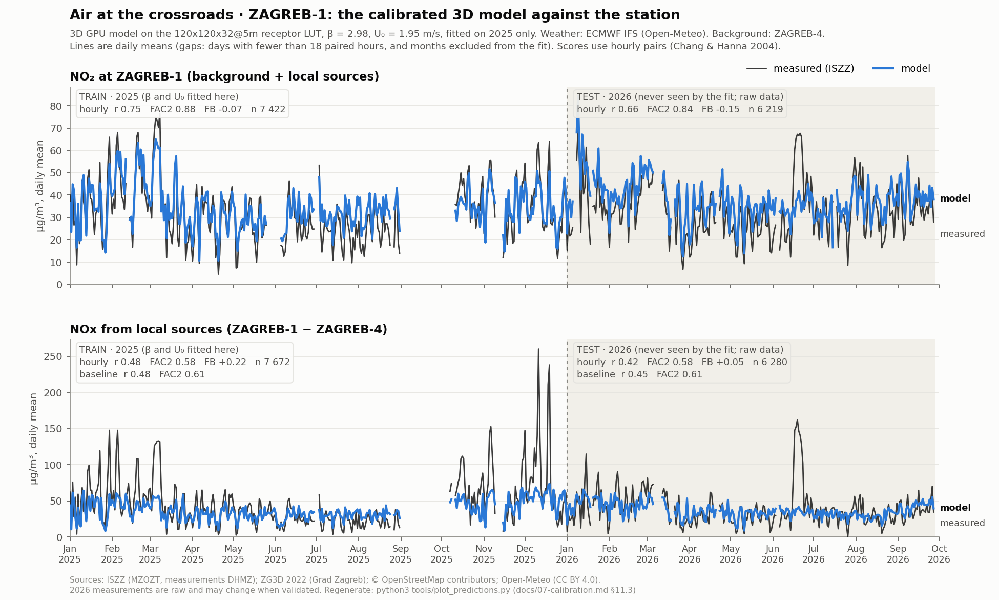

# 07 · Calibration and validation against ISZZ

This chapter explains how the two free numbers of the model, the emission scale β and the low-wind floor U0, are
fitted to the ZAGREB-1 measurements, and how the model is scored on hours it was not fitted on, against a statistical
baseline. §9 holds the current results and is regenerated by `tools/calibrate.py`; §10 reads the Gaussian fallback's
fit and §11.1 the first 3D fit (on the 10 m grid). The emissions that β scales are in [05 Emissions](05-emissions.md);
the receptor LUT that the 3D fit uses is in [03 Wind](03-flow-lbm.md) §7–8.

*First draft by the models owner [models]. Covers `tools/calibrate.py`, `src/data/calibration.json`, the receptor
model it calibrates (`src/js/meteo.js`, `src/js/model.js`, `src/js/fallback.js` and their mirror `tools/aqmodel.py`),
and the tests in `tests/python/test_aqmodel.py` and `src/js/tests/models.test.js`. §9 is regenerated by every run of
`tools/calibrate.py`; everything else was written on 2026-09-28.*

Binding: `docs/research/critic.md` §4.7 (the protocol), §1.1 (IFS wind, U0 prior), §1.2 (ZAGREB-4 background),
§1.12 (β ≈ 4 expected for the Gaussian) and gap G11 (the baseline must be recomputed with ZAGREB-4). Background is
physics.md §10.

---

## 1. Purpose

The physics model has two free numbers that no reference measurement fixes: the emission scale **β** and the low-wind
floor **U0**.

- **β** absorbs errors in AADT, emission factors, the NWP roughness z0r, and the missing shelter of the Gaussian
  fallback.
- **U0** lumps vehicle-induced turbulence, meander and heat-island mixing at calm.

`tools/calibrate.py` fits both to the ISZZ measurements at ZAGREB-1 and scores the result **on hours it was not fitted
on**. It also scores a trivial statistical baseline the same way, because the physics must beat it before it can
claim skill beyond climatology (physics §10.5). The result, `src/data/calibration.json`, is embedded in the page as
`CAL`. It drives the "Koliko je točno? / How good is it?" panel and the β used for every modelled number.

## 2. What is fitted and what is not

| Parameter | Fitted? | How | Source |
|---|---|---|---|
| β (emission scale) | **yes** | log least squares, jointly with U0 | physics §10.3; what β = 1 under-predicts: [05 Emissions](05-emissions.md) §10 |
| U0 (low-wind floor) | **yes** | grid 0.50–3.00 m/s in 0.05 steps | prior 1.4 m/s for IFS (critic §1.1) |
| h_min (lid floor) | no, 100 m | the LUT and the fallback are computed with a fixed representative lid per class, so a discrete choice would need a LUT per option | physics §6.5 |
| f_NO2 | no, 0.10 | oxidant regression and the chemistry test | critic §1.2 |
| PM, CO, benzene factors | no | bottom-up and increment ratios | chapter 05 |
| Sc_t, λ, σθ | no | defaults; sensitivity only, to avoid over-fitting one station | physics §10.3 |

## 3. The model that is calibrated

For every hour t (hour-ending UTC), exactly as `concentrations()` computes it in the page:

1. **Meteorology** is the ECMWF IFS hour-ending mean at the station grid point (`data/processed/ifs_hourly.csv.gz`,
   chapter 01 §3). The wind is the vector mean of t−1 h and t, and `shortwave_radiation` is used as delivered (already
   a preceding-hour mean). The station anemometer is never used (critic §1.5).
2. **Stability class** comes from `stabilityClass({u10, sw, cloud})` (physics §6.4, verified against EPA-454/R-99-005):

   | By day (G > 0), SRDT | U < 2 | 2–3 | 3–5 | 5–6 | ≥ 6 m/s |
   |---|---|---|---|---|---|
   | G ≥ 925 W/m² | A | A | B | C | C |
   | 675–925 | A | B | B | C | D |
   | 175–675 | B | C | C | D | D |
   | < 175 | D | D | D | D | D |

   | By night, Turner | U < 1.9 | 1.9–3.4 | 3.4–5.5 | ≥ 5.5 m/s |
   |---|---|---|---|---|
   | cloud > 40 % | F | E | D | D |
   | cloud ≤ 40 % | F | F | E | D |
   | overcast (≥ 95 % = 10/10 in tenths) | D | D | D | D |

   The class maps to a group (A–C → `AC`, D, E–F → `EF`). Each group has a representative class (B, D, F: the most
   frequent in 2025) and a lid, the class median of IFS BLH floored at h_min (B 520 m, D 135 m, F 100 m;
   `mixingHeight`). They also give the Obukhov length (Golder 1972, z0′ = min(z0, 0.5 m)) and u*/U10
   (blending-height matching), all passed to the GPU solver as `turbParams()` (architecture §6.2).
3. **Unit responses** Γ_k(θ_j, s) at the inlet (0, 4 m, 0) come from the receptor LUT of the GPU model (§4.4 of
   the architecture, model `lbm`) or from the Gaussian fallback (model `gauss`, §4 below). They are smoothed over the
   16 run directions θ_j (physics Eq. 10.1):
   ```
   Γ̃_k = Σ_j w_j Γ_k(θ_j),   w_j ∝ exp(−δ(θ, θ_j)² / 2σθ²),   σθ = min(60°, 22.5°·max(1, 2/U))
   ```
   All directions get the same weight for U < 0.5 m/s.
4. **Emissions** are q_k = `groupStrengths('nox', t, today, {heating: 'auto'})` (chapter 05): today's traffic and fleet,
   with heating from October to March.
5. **Increment:**
   ```
   ΔNOx_mod(t) = 1e6 · β · Σ_k q_k(t) Γ̃_k(t) / √(U10(t)² + U0²)            (physics Eq. 10.1)
   ```

The same functions exist in JavaScript (the page) and Python (`tools/aqmodel.py`). 1 286 parity vectors keep them
identical to 1e-6 (§7), so the calibrated β means the same thing in both.

## 4. The Gaussian fallback (model `gauss`)

The page uses this model whenever there is no GPU field and no LUT. Until the LUT is exported it is also the only model
that can be calibrated offline (`status: "fallback-only"`). `fallback.js` / `aqmodel.FallbackModel` implement physics
§9 with the architecture's normalisation, so its Γ has the units of the GPU solver's.

- **Point sources.** Every road with a source group is cut into points at most 4 m apart. For the env.json of
  2026-09-27 (before the frame fix) that was 16 488 points within 800 m. Each point carries W = AADT/10 000 · Δs [m].
  Heating polygons are sampled on 10 m cells with W = w · 100 m².
- **Plume kernel** (physics Eq. 9.5). For a receptor x > 0.5 m downwind and y across:
  ```
  Γ_m = W / (2π σy σz) · exp(−y²/2σy²) · Σ_{n=−3..3} [exp(−(z_r − h_s + 2nh)²/2σz²) + exp(−(z_r + h_s + 2nh)²/2σz²)]
  σy² = σy0² + σyB(x)²,   σz² = σz0² + σzB(x)²
  ```
  - Ground reflection and lid images at the class mixing height h. The |n| ≥ 1 terms are summed only when
    σz > h/4, and terms below e⁻⁴⁰ are skipped.
  - σy0 = W/2 for roads (carriageway width), 5 m for heating cells. σz0 = 2 m (physics §9.2).
  - Source height 0.5 m for roads, 8 m for heating; receptor z_r = 4 m.
- **Briggs urban curves** (McElroy–Pooler; physics §9.2):

  | Class | σyB | σzB |
  |---|---|---|
  | A–B | 0.32x(1+0.0004x)^−½ | 0.24x(1+0.001x)^½ |
  | C | 0.22x(1+0.0004x)^−½ | 0.20x |
  | D | 0.16x(1+0.0004x)^−½ | 0.14x(1+0.0003x)^−½ |
  | E–F | 0.11x(1+0.0004x)^−½ | 0.08x(1+0.0015x)^−½ |

- **Plume speed.** Γ is normalised by U_eff of the 10 m wind, like the GPU path. Physics §9.2 would use the wind at the
  plume height, which near the ground is 2–3× slower. That missing shelter is part of what β absorbs, which is why the
  critic expects β ≈ 4 for this model (critic §1.12) and a smaller β for the LBM.
- **Age.** A_m = Γ_m x_m, so τ = mean travel distance / U_eff.
- **OSPM-type canyon term** (physics §9.1).
  - When. The nearest stretch of a group within 60 m has buildings on both sides (rays up to 80 m) with H/W ≥ 0.3,
    the wake-interference lower bound of Oke (1988). Then the recirculation box term
    Γ_r = Q·L_r/(W σ̂_wt L_t)·|cos φ| is added, with L_v = 2 H_upwind, σ̂_wt = 0.1 û(H) and constants from physics §9.1
    (Eq. 9.4; to be verified: gap G9).
  - Result. For today's geometry no group qualifies at ZAGREB-1: the east side of Miramarska is open park (Park Stjepana Srkulja), and Vukovarska has
    H/W ≈ 0.1–0.3. This is consistent with the SW–W minimum of the measured increment rose (physics F6).
- **Speed** in the browser, measured under heavy machine load: `receptor()` takes 2–13 ms per direction (cached),
  `slice()` about 2 s for 60 × 60 cells at 10 m and 8.5 s for 120 × 120 at 5 m. `sliceAsync()` runs it in chunks. In
  Python, the 96-entry table (16 directions × 6 classes) takes about 5 s.

## 5. Protocol

1. **Pairing** (physics §10.1).
   - ΔNOx_obs = NOx(ZAGREB-1) − NOx(ZAGREB-4) for the same hour-ending stamp.
   - The processed table uses validated values wherever ISZZ has published them (chapter 01 §2.6).
   - **Negative increments are kept.** Hours with ΔNOx_obs ≤ −c0 cannot enter the log objective; they are counted
     (`n_dropped_log`) and stay in the metrics.
   - A calendar month enters only with ≥ 75 % of its hours paired.
2. **Objective** (physics Eq. 10.2):
   ```
   J(β, U0) = Σ_t [ln(ΔC_obs,t + c0) − ln(ΔC_mod,t + c0)]²,   c0 = 10 µg/m³
   ```
   - The log form treats factor errors symmetrically, and c0 handles near-zero and negative increments.
   - For each U0 on the grid, ln β is bracketed on 41 points over [ln 0.05, ln 50] and refined by golden-section
     search (tolerance 10⁻⁴ in ln β).
   - numpy only vectorises the sums. `--no-numpy` gives the same result, which a unit test checks.
3. **Validation on held-out data only** (critic §4.7).
   - **Two folds by half-year:** train January–June → test July–December, then the reverse. `metrics_test` is
     computed on the union of the two test halves, so every hour is predicted by parameters that never saw it.
   - **Leave-one-month-out** (`metrics_lomo`): 11–12 folds.
   - The **published β and U0** are fitted on the whole period (what the page uses). Their in-sample score is **not**
     published.
4. **Baseline** (physics §10.5, recomputed with ZAGREB-4 and IFS as gap G11 requires): ΔC = P(d, h) · S(s) / √(U² + 1.2²).
   - P is the median of ΔC·U_eff per day type d (weekday / Saturday / Sunday-or-holiday) and local hour start h:
     72 bins, the "hour-of-week" profile.
   - S is the median of ΔC·U_eff/P per IFS wind sector s: 16 bins.
   - It is trained on the same training halves and scored on the same test hours as the model.
   - The physics model should beat it on R, VG and NMSE before claiming skill beyond climatology.
5. **Diagnostics** (physics §10.6), on the test predictions: the ratio of mean observed to mean modelled
   increment by 16 sectors (U > 1.5 m/s), by local hour, by class, by wind-speed bin, by month and by day type.
   Also computed:
   - the end-to-end NO2 and NOx totals, with the FAIRMODE MQI for NO2;
   - the chemistry-only check (chapter 06 §7.1);
   - the climatological congestion shares φ_A, φ_B (chapter 05 §7).

## 6. Metrics (Chang & Hanna 2004, as `metrics()` in model.js and aqmodel.py)

C_o is observed and C_p predicted. **FB > 0 means under-prediction.**

| Metric | Definition | "Good model" (Chang & Hanna 2004, as usually operationalised) | Urban (Hanna & Chang 2012) |
|---|---|---|---|
| FB | (C̄_o − C̄_p) / (0.5 (C̄_o + C̄_p)) | \|FB\| ≤ 0.3 | \|FB\| < 0.67 |
| NMSE | mean((C_o − C_p)²) / (C̄_o C̄_p) | ≤ 1.5 | < 6 |
| MG | exp(mean ln C_o − mean ln C_p) | 0.7–1.3 | – |
| VG | exp(mean (ln C_o − ln C_p)²) | ≤ 4 | – |
| FAC2 | fraction with 0.5 ≤ C_p/C_o ≤ 2 | ≥ 0.5 | > 0.30 |
| NAD | mean \|C_o − C_p\| / (C̄_o + C̄_p) | – | < 0.50 |
| R | Pearson correlation | – | – |

- **Threshold convention.** MG, VG and FAC2 are undefined for zero or negative values. Chang & Hanna recommend a
  lower threshold, and physics §10.4 uses 1 µg/m³ for increments. Both series are clipped at 1 µg/m³ **for these
  three metrics only**, so a pair with both values below 1 counts as a FAC2 hit (the Hanna & Chang 2012 convention).
  FB, NMSE, NAD and R use the raw values.
- **Not directly comparable.** The physics report's baseline table excluded all pairs with either value ≤ 1 from every
  metric. Its numbers (test R 0.31 with the Mirogojska background) therefore differ from the recomputed baseline below.
- **FAIRMODE MQI** for totals (physics Eq. 10.5, Vitali et al. 2023): MQI = RMSE / (2 RMS_U) with
  U(O) = U_r √((1 − α²) O² + α² RV²). For NO2, U_r = 0.24, RV = 200 µg/m³, α = 0.20. MQI ≤ 1 meets the objective.

## 7. Tests

| Test | Result (2026-09-28) |
|---|---|
| `metrics()` on hand-computed vectors ([1, 2, 3, 4] vs [2, 2, 3, 8]: FB −0.4, NMSE 0.4533, MG 0.7071, VG 1.2716, FAC2 1, NAD 0.2, R 0.8540); perfect model; FAC2 floor | pass, JS and Python |
| `fit()` recovers β = 3.0, U0 = 1.3 from synthetic exact data, with and without numpy | β within 0.02, U0 within one grid step |
| Baseline reproduces a pure hour-profile / U_eff signal | NMSE < 1e-9 |
| `write_if_changed` does not rewrite identical content | pass (idempotent) |
| Python ↔ JS parity (1 286 vectors, 25 sections: meteorology, chemistry, emissions, fallback receptor and slice, increment, metrics, MQI) | all within 1e-6 relative |
| Fallback: a 4 km crosswind road matches the analytic line-source formula W/(√(2π) σz)·(vertical terms) | within 1 % |
| Fallback: linear in AADT; zero when the road is downwind; canyon term on the synthetic canyon, zero for parallel wind | pass |
| Fallback on ENV: `receptor()` < 1 s | 2–13 ms per direction |
| Regression (review 2026-09-28): the held-out totals use the fold's U0 for the plume age, not the whole-period fit (`test_totals_use_the_fold_u0_not_the_whole_period_fit`) | pass |
| Regression (physics review 2026-09-28): the 3D β and U0 apply only to a LUT on the grid they were fitted on (`models: a 3D calibration is applied only to a LUT on its own grid`) | pass |

Run with `python3 -m unittest tests/python/test_aqmodel.py -v` and `python3 tests/browser/run_selftest.py --only models`.

## 8. Output: `src/data/calibration.json` (architecture §4.3, with additions)

| Field | Meaning |
|---|---|
| `status` | `"calibrated"` (LBM LUT fitted), `"fallback-only"` (only the Gaussian fitted), or `"uncalibrated"` (the prior of tools/build.py) |
| `beta`, `U0`, `model` | parameters of the model named in `model` (`lbm` or `gauss`) |
| `h_min`, `f_no2` | the fixed lid floor and primary NO2 fraction used |
| `period`, `fetch_date` | calibration period; when the ISZZ table was fetched (G10: validated data may be revised) |
| `metrics_test`, `baseline_test` | held-out Chang & Hanna metrics of the model and the baseline |
| `by_sector[16]`, `by_hour[24]` | obs/mod ratios on the test predictions |
| `gauss`, `lbm` | the full result per model: `beta`, `U0`, `metrics_test`, `metrics_lomo`, `baseline_*`, `raw_physics_test`, `folds`, `lomo_params`, `totals_test`, `by_*`, `mean_obs`, `mean_mod_raw`. `lbm` is null until the LUT exists |
| `baseline` | definition, U0 and metrics of the baseline |
| `congestion_share` | climatological φ_A, φ_B for the rush-hour measure (chapter 05 §7) |
| `chemistry_check` | chemistry alone with measured NOx (chapter 06 §7.1) |
| `inputs`, `notes`, `generated_utc` | provenance: files, env.json version, capture per month, c0, grid; free text |

**How the page uses it** (`mod_calFor()` in model.js):

- Fallback results use `gauss.beta` and `gauss.U0`.
- LUT and live-field results use the top-level β and U0 only when `model` is `lbm` and `status` is `calibrated`.
  Otherwise they use the priors (β = 1, U0 = 1.4) and are labelled "uncalibrated". The Gaussian β is never applied to
  the 3D model.
- The "raw physics" toggle forces β = 1 and U0 = 1.4 everywhere.

## 9. Current results

<!-- CALIBRATION-RESULTS-BEGIN (tools/calibrate.py writes this block) -->
*Generated by `tools/calibrate.py` at 2026-09-28T10:41:01Z from `src/data/calibration.json`. Do not edit by hand.*

- **Status:** `calibrated`, model `lbm`.
- **Period:** 2025-01-01 … 2025-12-31, 7 672 paired hours in 11 months with ≥ 75 % capture (excluded: 2025-09 (54%)).
- **Data:** `data/processed/iszz_hourly.csv.gz`, `data/processed/ifs_hourly.csv.gz`; ISZZ fetched 2026-09-27T21:50:21Z; env.json of 2026-09-28T07:26:42Z.
- **Fitted on the whole period:** β = **2.980**, U0 = **1.95 m/s**; h_min = 100 m and f_NO2 = 0.1 fixed. 66 hours with ΔNOx ≤ −c0 could not enter the log objective.
- **Folds:** train Jan–Jun → β 3.465, U0 2.30; train Jul–Dec → β 2.289, U0 1.40. Leave-one-month-out: β 2.788–3.249, U0 1.80–2.25 m/s.

**Local NOx increment ΔNOx = ZAGREB-1 − ZAGREB-4, held-out hours only** (two half-year folds; µg/m³):

| Metric | model, test | model, LOMO | baseline, test | raw physics (β 1, U0 1.4) | Chang & Hanna 2004 "good" | Hanna & Chang 2012 urban |
|---|---|---|---|---|---|---|
| FB | 0.234 | 0.224 | 0.260 | 0.998 | \|FB\| ≤ 0.3 | \|FB\| < 0.67 |
| NMSE | 1.450 | 1.446 | 1.530 | 4.857 | ≤ 1.5 | < 6 |
| MG | 0.946 | 0.916 | 0.928 | 2.257 | 0.7–1.3 | – |
| VG | 3.174 | 3.185 | 2.989 | 6.055 | ≤ 4 | – |
| FAC2 | 0.573 | 0.576 | 0.582 | 0.314 | ≥ 0.5 | > 0.30 |
| NAD | 0.337 | 0.336 | 0.338 | 0.551 | – | < 0.50 |
| R | 0.482 | 0.472 | 0.461 | 0.488 | – | – |
| RMSE | 50.0 | 50.2 | 50.7 | 59.5 | – | – |
| meanObs | 46.7 | 46.7 | 46.7 | 46.7 | – | – |
| meanMod | 36.9 | 37.3 | 35.9 | 15.6 | – | – |
| n | 7 672 | 7 672 | 7 672 | 7 672 | – | – |

**Totals at ZAGREB-1** (test increments + ZAGREB-4 background; NO2 through the chemistry of chapter 06):

| Metric | NO2 | NOx | Chang & Hanna 2004 "good" | Hanna & Chang 2012 urban |
|---|---|---|---|---|
| FB | -0.069 | 0.148 | \|FB\| ≤ 0.3 | \|FB\| < 0.67 |
| NMSE | 0.183 | 0.565 | ≤ 1.5 | < 6 |
| MG | 0.899 | 1.019 | 0.7–1.3 | – |
| VG | 1.247 | 1.380 | ≤ 4 | – |
| FAC2 | 0.873 | 0.797 | ≥ 0.5 | > 0.30 |
| NAD | 0.153 | 0.211 | – | < 0.50 |
| R | 0.745 | 0.775 | – | – |
| RMSE | 14.2 | 50.5 | – | – |
| meanObs | 32.1 | 72.3 | – | – |
| meanMod | 34.4 | 62.3 | – | – |
| n | 7 422 | 7 422 | – | – |

FAIRMODE MQI for hourly NO2: **0.54** (objective ≤ 1). Chemistry alone with measured NOx: RMSE 5.11 µg/m³, r 0.966, MQI 0.196 (n = 7 422).

**Diagnostics: mean observed / mean modelled on the test predictions** (1 = unbiased; > 1 = under-prediction; – = fewer than 30 hours):

By IFS wind sector (U10 > 1.5 m/s):

| N | NNE | NE | ENE | E | ESE | SE | SSE | S | SSW | SW | WSW | W | WNW | NW | NNW |
|---|---|---|---|---|---|---|---|---|---|---|---|---|---|---|---|
| 1.10 | 1.19 | 1.41 | 1.74 | 1.45 | 1.28 | 0.94 | 1.02 | 1.60 | 1.81 | 1.87 | 1.34 | 0.76 | 0.57 | 0.85 | 1.25 |

By local hour start (model, then baseline):

| h | 00 | 01 | 02 | 03 | 04 | 05 | 06 | 07 | 08 | 09 | 10 | 11 | 12 | 13 | 14 | 15 | 16 | 17 | 18 | 19 | 20 | 21 | 22 | 23 |
|---|---|---|---|---|---|---|---|---|---|---|---|---|---|---|---|---|---|---|---|---|---|---|---|---|
| model | 1.31 | 1.56 | 2.04 | 2.02 | 2.09 | 2.21 | 1.66 | 1.42 | 1.35 | 1.46 | 1.55 | 1.58 | 1.46 | 1.42 | 1.39 | 1.38 | 1.13 | 0.95 | 0.92 | 0.85 | 0.91 | 0.94 | 1.11 | 1.16 |
| baseline | 1.80 | 2.09 | 2.18 | 1.75 | 1.66 | 1.16 | 1.23 | 1.28 | 1.26 | 1.19 | 1.21 | 1.13 | 1.15 | 1.17 | 1.14 | 1.24 | 1.32 | 1.33 | 1.27 | 1.17 | 1.17 | 1.26 | 1.50 | 1.66 |

| By class | A | B | C | D | E | F |
|---|---|---|---|---|---|---|
| obs/mod | 1.07 | 1.55 | 1.93 | 1.21 | 1.22 | 1.16 |

| By U10 (m/s) | 0-0.5 | 0.5-1 | 1-2 | 2-3 | 3-5 | 5-∞ |
|---|---|---|---|---|---|---|
| obs/mod | 1.36 | 1.29 | 1.15 | 1.35 | 1.50 | 1.51 |

| By month | 01 | 02 | 03 | 04 | 05 | 06 | 07 | 08 | 10 | 11 | 12 |
|---|---|---|---|---|---|---|---|---|---|---|---|
| obs/mod | 1.48 | 1.45 | 1.55 | 1.30 | 1.16 | 0.97 | 0.76 | 0.71 | 1.42 | 1.32 | 1.43 |

| By day type | weekday | saturday | sunday |
|---|---|---|---|
| obs/mod | 1.40 | 0.93 | 0.97 |

Climatological congestion shares (weekday rush hours, Gaussian φ_k): A 0.219, B 0.371. Mean ΔNOx: observed 46.67, raw physics 15.59 µg/m³.

The Gaussian fallback's own fit (used when the page has no LUT or field): β = 2.975, U0 = 1.30 m/s, test R = 0.371.

<!-- CALIBRATION-RESULTS-END -->

## 10. Reading the results honestly

This section was written when only the Gaussian fallback could be calibrated, and its numbers are the fallback's
(`calibration.json` → `gauss`; they do not depend on the LUT). The 3D fit is read in §11.1, and its current numbers
are in §9.

- **β for the Gaussian is 3.0, not 4.**
  - Raw physics under-predicts the mean increment 3.9-fold (11.9 against 46.7 µg/m³), close to the critic's 4.2.
  - The log objective fits the *geometric* behaviour: after calibration MG ≈ 1.0 while FB ≈ +0.24. The typical hour
    is right, but the high-concentration hours are under-predicted.
  - A mean-matching β would be ≈ 3.9 but would over-predict most hours. The log fit is the protocol (physics §10.3).
- **U0 = 1.30 m/s** matches the critic's refit with IFS wind and the ZAGREB-4 background (1.31–1.34 m/s, critic §1.1)
  and is stable across folds.
- **The Gaussian fallback does not beat the statistical baseline.**
  - R is 0.37 against 0.46; the baseline also has the lower NMSE and VG, and the higher FAC2.
  - The baseline has 88 free medians fitted to this station; the physics has two parameters.
  - Either way, the approximate model must not be presented as skilful beyond climatology. The UI says so.
- **Structural errors the diagnostics expose:**
  - *Night (02–06 h).* obs/mod ≈ 2–3, as in critic §1.12. The traffic table's night shares are low compared with the
    effective emission profile (chapter 05 §10), heating NOx is small, and a Gaussian plume without a canopy
    recirculation cannot trap emissions under a stable lid.
  - *North-west winds (NW, NNW).* obs/mod ≈ 5 at U > 1.5 m/s. With a NW wind no major road is upwind of the inlet in a
    flat-terrain plume model, but the measured increment stays high. Candidates:
    - recirculation behind the 7–9-storey slabs north-west of the station (a 3D-flow effect the LBM should capture);
    - the direction error of IFS, whose N/NW-dominated rose disagrees with ERA5's NNE/NE (critic §1.1);
    - a background mismatch: with N winds ZAGREB-4 lies upwind of nothing.
  - *Weekday vs weekend.* obs/mod is 1.39 on weekdays and 0.97–0.99 at weekends: the weekday traffic factor, or its
    HDV share, is too low relative to the weekend.
  - *Season.* obs/mod ≈ 1.3–1.7 in winter months and ≈ 0.8 in summer: the stable winter lid and heating are
    under-represented.
- **Totals look better than increments.**
  - End-to-end NO2 has FB ≈ 0, FAC2 0.86, R 0.75 and **MQI 0.53**, within the FAIRMODE objective, because the measured
    ZAGREB-4 background carries most of the variance.
  - This is the fair headline for "how good is the NO2 number the page shows", but the increment metrics are the test
    of the local model.

## 11. After the LUT export (the LBM path)

1. Build and export the receptor LUT with the GPU model (flow owner; critic G6): `python3 tools/export_lut.py`, which
   runs the page headless with `?sweep=lut` and writes `src/data/lut_receptor.json` (architecture §4.4: 16 directions
   × 3 groups × 4 source groups of Γ, age and band).
2. Re-run `python3 tools/calibrate.py`.
   - It detects the LUT and fits the `lbm` model with the same protocol, refitting the Gaussian alongside.
   - It sets `status: "calibrated"` and `model: "lbm"`, puts the LBM β and U0 at the top level, and regenerates §9.
   - The LUT's directions must be the 16 of `DIRS16`, and its classes `AC`, `D`, `EF`.
3. Rebuild the page (`python3 tools/build.py`). The UI then labels the 3D values "calibrated" and the fallback keeps
   its own β.
4. Compare `lbm.metrics_test` with the baseline. The critic expects β_LBM < β_gauss, because the 3D flow shelters the
   receptor. A clear R/VG/NMSE gain over the baseline is the evidence that the 3D model adds skill.

### 11.1 First LBM calibration: the 10 m LUT (integration run, 2026-09-28)

*Written by the integration review; the numbers are those of §9 at the time (calibration.json of
2026-09-27T23:36:07Z) for the LUT `60x60x16@10m` (16 directions × 3 groups, 'today', leaf-on, env.json of
2026-09-27T21:58:45Z, exported headless on SwiftShader with `tools/export_lut.py --grid coarse`). That env.json
predates the frame fix of 2026-09-28 (docs/02 §2.3): the LUT was computed on the slightly compressed geometry with
4,304 buildings. The 5 m export runs on the current geometry; once it is in, §9 shows the new fit and this section
stays as the record of the first one. The NO2 totals and MQI of that §9 block (both models) were computed before
the review fix that gives each held-out hour the plume age of its own fold's U0 (docs/11 §11.6); the increment
metrics, the NOx totals and β, U0 do not depend on it, and the next run of `calibrate.py` recomputes the NO2 totals.*

**Fit.** β = 3.09, U0 = 1.80 m/s (folds: β 2.48–3.46, U0 1.35–2.05; leave-one-month-out β 2.89–3.27). Raw physics
(β = 1, U0 = 1.4 m/s) gives a mean increment of 14.1 µg/m³ against the observed 46.7, a ratio of 3.3; the Gaussian's
raw ratio is 3.9 (46.7 / 11.9). β_LBM is not below β_gauss (2.96) as the critic expected: the LBM's raw mean is higher
than the Gaussian's, but its fitted U0 is also higher (1.80 against 1.30 m/s), and β and U0 trade off in the log
objective (a larger U0 lowers the model at low wind, which a larger β compensates).

**Against the baseline (held-out, two half-year folds):**

| | LBM (10 m) | baseline | Gaussian | better |
|---|---|---|---|---|
| R | 0.487 | 0.461 | 0.371 | LBM |
| NMSE | 1.44 | 1.53 | 1.69 | LBM |
| VG | 3.07 | 2.99 | 4.12 | baseline |
| FB | 0.239 | 0.260 | 0.237 | LBM ≈ Gaussian |
| FAC2 | 0.586 | 0.582 | 0.524 | LBM (marginally) |

The 3D path beats the statistical baseline on R and NMSE but not on VG, so by the protocol (critic §4.7: R, VG and
NMSE) skill beyond climatology is not yet shown on all three measures. The UI states this verdict under the metrics
table, computed from calibration.json.

**Increment rose (2025, 16 IFS sectors, U10 ≥ 0.5 m/s; mean ΔNOx in µg/m³, measured vs raw LBM):** the measured rose
is highest for NNW (63.6) and N (54.0), then ESE–S (45–51), and lowest for SW–W (24–26), which is physics F6. The LBM
reproduces the E–SE maximum (SE 20.1, ESE 18.6 raw) and the SW–W minimum (SW 5.8, WSW 6.6); the Spearman rank
correlation of the 16 sector means with the measurement is 0.72 (Gaussian 0.23). The ratio of the mean NNE–SE to the
mean SSW–W increment is 1.56 measured and 1.91 modelled. It under-predicts N and NNW (calibrated 34–39 against 54–64),
the sectors where the Gaussian fails completely (§10); IFS direction errors for northerlies (critic §1.1, §1.5) are
one candidate.

**One hour by hand** (NE 1.7 m/s, class D, Tuesday 13 January 2026, 08–09 h local, heating on, leaf-off field for the
nearest direction): raw 25.5 µg/m³ NOx increment (Miramarska 22.7, other roads 2.0, Vukovarska 0.5, heating 0.3);
calibrated 70.0. Measured January weekday 08 h increments: mean 136 µg/m³ (n = 66, all winds), 95 (n = 9, IFS wind
from 22.5–67.5°), 80 (n = 26, December–February, same sector). The raw model is 3.1–3.7× low for this situation, the
same factor as the annual mean. The Python mirror gives the same raw value (24.8 µg/m³ with the leaf-on LUT alone,
equal to the page's value before the leaf-off field arrived).

**Map check** (the live 10 m field at 1.5 m, raw NOx increment, the same hour): carriageways of Vukovarska and
Miramarska mean 65 µg/m³, cells within 25 m of them 41, other roads 20, parks 15; the 150–300 m upwind band 15
(median 6) against the downwind band 31 (median 10).

**Caveat.** The response depends on the grid (Γ_B at 5 m is 0.58× the 10 m value, Γ_D 0.33×; docs/03 §8.2). This β is
for the 10 m LUT only. It is superseded by the 5 m calibration of §11.2.

### 11.2 The 5 m LUT, the current calibration (2026-09-28)

**The LUT.**
- `120x120x32@5m`: 16 directions × 3 groups, 'today', leaf-on, on the env.json of 2026-09-28T07:26:42Z (after the frame
  fix).
- Exported headless on SwiftShader with `tools/export_lut.py --grid fine`. All 48 jobs completed, 0 failed, in 11,160 s
  (3.1 h), detached in tmux.
- It was installed as `src/data/lut_receptor.json`. The 10 m LUT is kept locally in `data/cache/lut/`, which is
  gitignored; it remains in git history.
- Its `meta.notes` records that its band is the pre-fix one and that it has no per-entry `quality` (Γ and A are
  unaffected).

**Grid sensitivity.** The medians of Γ(5 m)/Γ(10 m) over the 16 directions:

| Group | Vukovarska (A) | Miramarska (B) | other roads (C) | heating (D) |
|---|---|---|---|---|
| AC | 0.88 | 0.95 | 0.91 | 0.75 |
| D | 1.28 | 0.83 | 0.87 | 0.61 |
| EF | 1.39 | 0.85 | 0.88 | 0.64 |

**Fit.**
- β = 2.98, U0 = 1.95 m/s.
- Folds: β 2.29–3.47, U0 1.40–2.30. Leave-one-month-out: β 2.79–3.25.
- Raw physics (β = 1, U0 = 1.4) gives a mean increment of 15.6 against the observed 46.7 µg/m³, a factor of 3.0.

**Held-out skill** (§9 has the full table):

| | LBM 5 m | LBM 10 m (§11.1) | baseline | Gaussian |
|---|---|---|---|---|
| R | 0.482 | 0.487 | 0.461 | 0.371 |
| NMSE | 1.45 | 1.44 | 1.53 | 1.69 |
| VG | 3.17 | 3.07 | 2.99 | 4.12 |
| FB | 0.234 | 0.239 | 0.260 | 0.237 |
| FAC2 | 0.573 | 0.586 | 0.582 | 0.524 |

- The 5 m and 10 m calibrations have practically the same skill. The finer grid changes the individual responses by
  −40…+40 %, and the refit of β and U0 absorbs most of that.
- The 3D model beats the statistical baseline on R, NMSE, FB and RMSE, but not on VG or FAC2. So by the protocol's
  three measures (R, VG, NMSE), skill beyond climatology is shown on two of three.
- The increment meets every Chang & Hanna (2004) "good model" criterion that has a threshold (FB, NMSE, MG, VG, FAC2).

**End to end.** Held-out hourly NO₂ at the station, with ZAGREB-4 background and the chemistry of chapter 06:
r = 0.745, FAC2 = 0.87, FB = −0.07, RMSE 14.2 µg/m³. The FAIRMODE MQI is 0.54, within the objective of ≤ 1. These
totals already use each held-out hour's own fold U0 (the review fix).

**Structural errors that remain** (§9 diagnostics, obs/mod on held-out hours):
- The model is too low at night, 2.0–2.2 at 02–05 h.
- It is too low for SSW–SW winds, 1.8–1.9.
- It is too high for W–WNW, 0.57–0.76.

### 11.3 Out-of-sample check: fitted on 2025, predicting 2026



`tools/plot_predictions.py` keeps β = 2.98 and U0 = 1.95 m/s exactly as the page uses them. These
values were fitted on 2025 only. The tool predicts every paired hour of 2025 and of 2026 (up to the last processed
hour) through the calibration's own code path. The lines are daily means, and the scores use hourly pairs. The 2025
scores are **in-sample**: the fit saw those hours. The half-year held-out scores for 2025 are in §9. The 2026 scores
are a true **out-of-sample** test, on raw data that are not yet validated. The numbers are in
`docs/img/predictions_2025_2026.json`.

| Hourly scores | NO₂ total, 2025 | NO₂ total, 2026 | ΔNOx, 2025 | ΔNOx, 2026 | baseline ΔNOx, 2025 | baseline ΔNOx, 2026 |
|---|---|---|---|---|---|---|
| r | 0.75 | 0.66 | 0.48 | 0.42 | 0.48 | 0.45 |
| FAC2 | 0.88 | 0.84 | 0.58 | 0.58 | 0.61 | 0.61 |
| FB | -0.07 | -0.15 | +0.22 | +0.05 | +0.25 | +0.03 |
| NMSE | 0.18 | 0.23 | 1.42 | 1.03 | 1.48 | 0.96 |
| n | 7,422 | 6,219 | 7,672 | 6,280 | 7,672 | 6,280 |

**Reading it honestly:**
- **Total NO₂ holds up out of sample.** r falls from 0.75 to 0.66, and 84 % of 2026 hours stay within a factor of 2.
  The model is about 15 % high in 2026 (FB −0.15), where it was about 7 % high in 2025. The raw 2026 data are one
  candidate cause: validation changes NOx by a few µg/m³ (docs/01 §10). The traffic and fleet of 2026 are another.
- **The local increment loses skill against the baseline in 2026.** r is 0.42 against 0.45, FAC2 0.58 against 0.61,
  and NMSE 1.03 against 0.97. In 2025 the two were level. So out of sample, the 3D model's hour-to-hour NOx
  increment is **not** better than the statistical hour-of-week × wind-sector model fitted on the same year. Its
  bias is good (FB +0.05). Its value is the physical explanation and the what-if scenarios, not a better hourly
  forecast of the increment.
- **Both models miss the big episodes.** These are the winter inversion days of November–December 2025 (daily ΔNOx up
  to 260 µg/m³) and a two-week June 2026 event (up to 160 µg/m³). The June event looks local: a construction site or
  a traffic diversion is plausible, but not confirmed. Neither model knows about such events; the 100 m lid floor
  and three stability groups cannot reproduce the shallowest inversions (§10, docs/09 §9.1).

Re-run after every recalibration or data refresh: `python3 tools/plot_predictions.py` (needs matplotlib, dev only).

## 12. Limitations and caveats

- **One station, one year.** Everything is fitted at ZAGREB-1 for 2025 (September is excluded: 54 % capture).
  Never transfer β or U0 to another station without re-validation (physics §10.7).
- **The background is 4.4 km away** and is itself urban-influenced for some wind directions. Its errors go straight
  into the observed increment.
- **Validated data may be revised** (G10). `fetch_date` records the snapshot. Re-run after a re-fetch before
  publishing numbers.
- **IFS wind at 9 km** is not the street wind. Its direction error is part of what σθ and the diagnostics absorb.
- **The fallback's structural gaps** (§10) mean its β compensates for different things than the LBM's will. The two
  are never mixed.
- **The two models see different source areas.** The GPU tunnel covers 300 m upwind and ±300 m across; the fallback
  sums roads within 800 m and all heating tiles. For westerly winds, for example, the fallback's Γ_D is 1.9 and the
  LUT's is 0.0003, because the heating tiles lie 300–600 m west (physics review 2026-09-28). Their β values are
  therefore not comparable per group. This is one more reason the page never applies the Gaussian β to 3D values.
- **β belongs to one grid.** The 3D fit is valid only for the LUT grid it was made on (`lbm.lut_meta.grid`). Γ differs
  by up to 3× between the 10 m and 5 m grids. model.js checks the grid and shows the priors, labelled "uncalibrated",
  when the embedded LUT is on another grid (physics review, finding 1). Re-run `calibrate.py` after every LUT export.
- **Per-entry solve quality.** LUTs exported with the code of commit `9a896b9` or later carry `quality[dir][class]`
  (converged, mass error), and `tools/export_lut.py --check` warns about entries that did not converge or miss the
  mass tolerance. The embedded 5 m LUT (exported 2026-09-28, 09:28–12:34) predates it (docs/11 §11.6). A re-export
  with the current code adds `quality` and the centred band.
- **Development mode.** `--dev` (or missing processed tables) reads the research caches instead. The output then says
  `"dev_data": true` and the notes say so. The current file was made from the processed tables (`"dev_data": false`).

## 13. How to re-run

```
python3 tools/calibrate.py                                  # 2025, processed tables, env.json, LUT if present; refreshes §9
python3 tools/calibrate.py --period 2024-09-01 2025-12-31   # another period (IFS BLH exists from 2024-09)
python3 tools/calibrate.py --dev                            # research caches (development only)
python3 tools/calibrate.py --no-numpy --no-docs             # pure Python; leave this chapter alone
python3 -m unittest tests/python/test_aqmodel.py
```

The script is idempotent. It rewrites `calibration.json` only when the content changes, and the results block above
only when its text changes. The LUT export that must come first, and the rebuild after, are in
[10 Runbook](10-runbook.md) §10.4. It takes about 6 s with numpy (the Gaussian table: 96 receptor evaluations) and about a
minute without.
