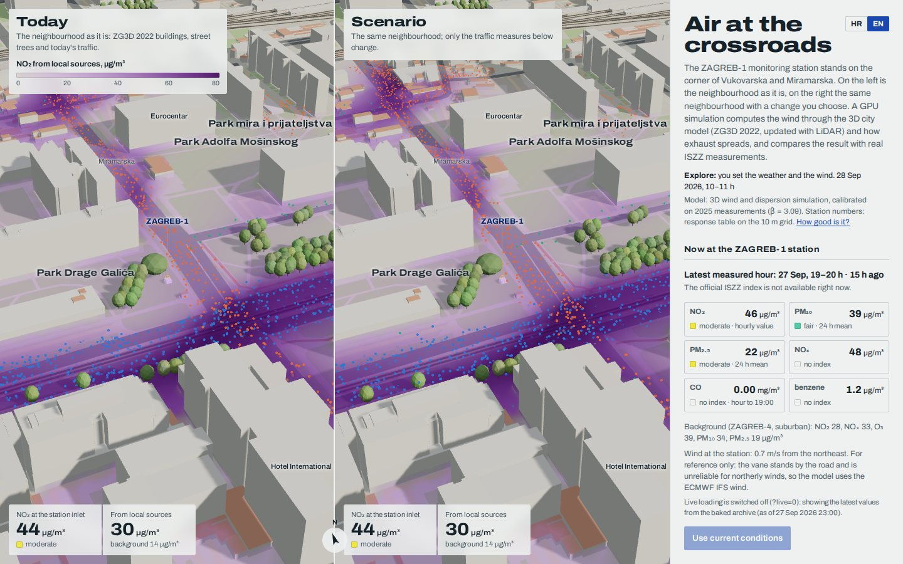
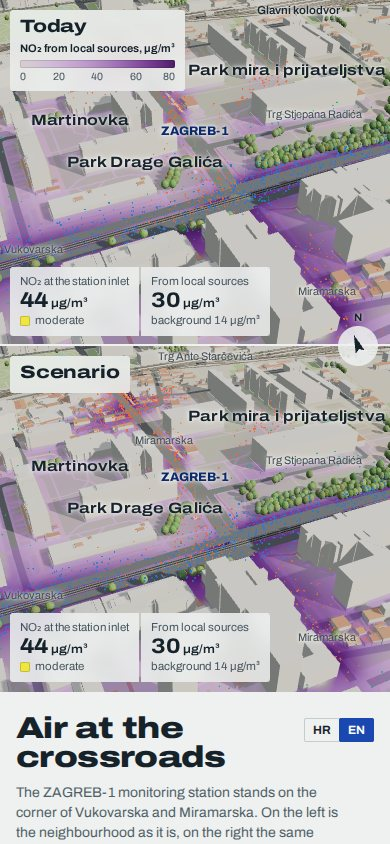
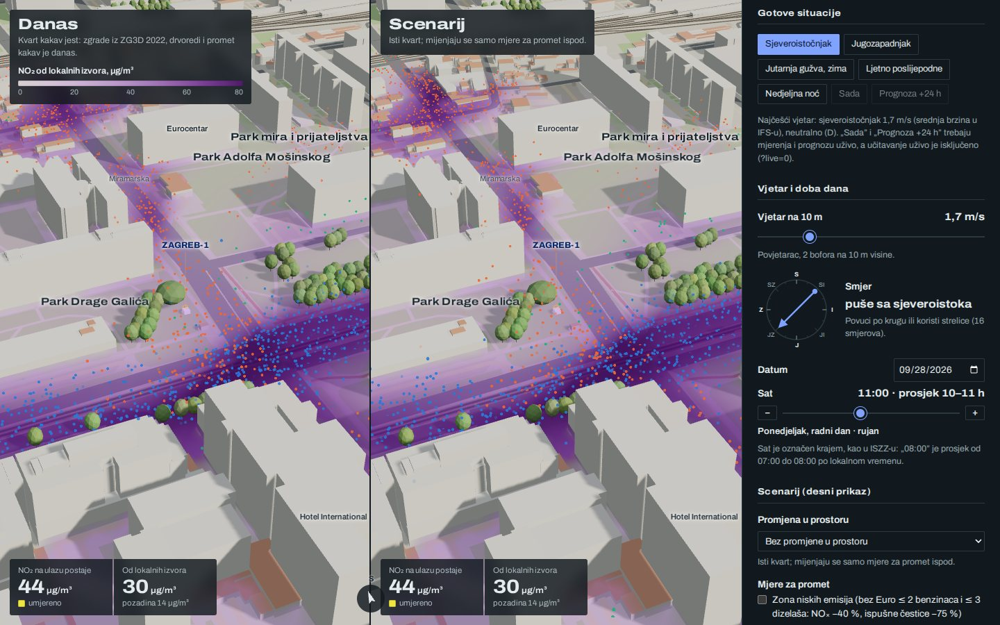
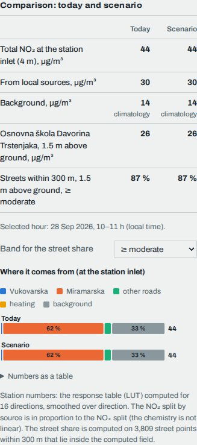
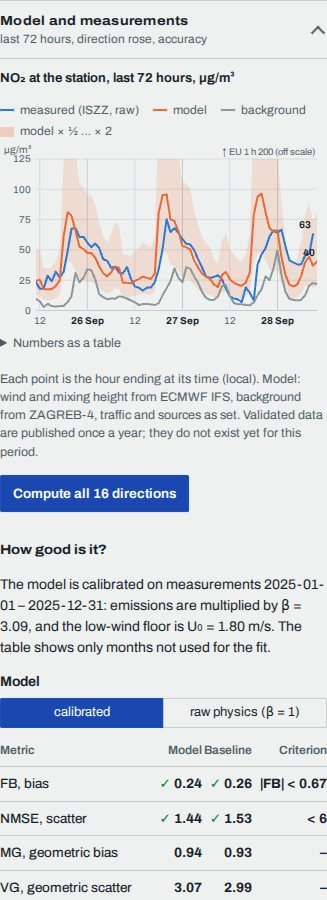
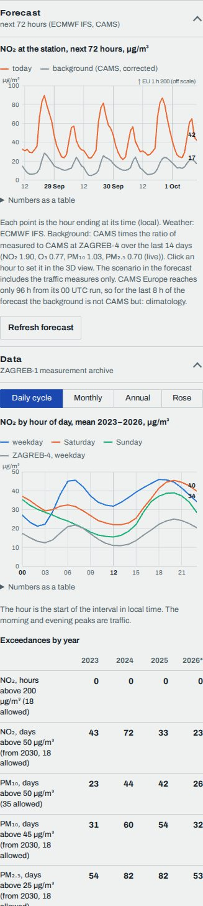

# 08 User guide

This chapter explains every part of the page: what each control does to the model, which changes are
instant and which need a new wind simulation, how to read the charts, the presets, the three modes, keyboard
use, the URL parameters and what to do when something looks wrong. The last section is for developers: the
files, the state object, how the page talks to the other modules, and how the UI is tested.

The page is one HTML file (`dist/index.html`, built by `tools/build.py`). It needs a browser with WebGL2 for the
3D view and the GPU wind tunnel. Everything else, including the charts, the measurements and the approximate
model, also works without it.



*Desktop, 1440 × 900. Left: today's neighbourhood. Right: the scenario. The violet colour on the ground is the
concentration slice 4 m above the ground, computed on the GPU: by default the NO₂ that local sources add on top of the
background, darkest on the roads and downwind of them (§3.8); the dots are display particles released from the roads,
coloured by source (blue Vukovarska, orange Miramarska, green other roads, grey heating).*

---

## 1. Layout

| Part | What it is |
|---|---|
| **Stage** (left, or top on phones) | Two 3D views of the same place. **Danas / Today** shows the city as built. **Scenarij / Scenario** shows the same city with the change you chose. Both views share one camera and the same weather and hour. |
| **View card** (top of each view) | The view's title, a one-line description, and, while the GPU computes, what it is doing ("Computing wind from the northeast · Wind on the 10 m grid 20 %") with a progress bar along its bottom edge. The card of the first visible view also holds the **map legend** (§3.8): what the colour on the ground means, with its scale. |
| **View numbers** (bottom of each view) | The modelled total at the station inlet (4 m above ground) for the selected pollutant, its air-quality band **in words** (the colour swatch is only a hint), and the part that comes from local sources, with the background next to it. The numbers turn grey while a new field is being computed (§4). |
| **North arrow** | Turns with the camera. "S" in Croatian (*sjever*), "N" in English. |
| **Panel** (right, 372 px; below the stage on phones) | The essentials first, open: now at the station, presets, wind and time, the scenario, the pollutant, the comparison and what the map shows. Everything else is in four collapsible groups: **Advanced settings**, **Model and measurements**, **Forecast**, **Data**. Nothing was removed; §3 describes the panel in order. |
| **Notices** (top of the panel) | Error and warning cards: a module that did not load, live data that failed, a forecast that is not available. They also appear in `window.__z1.errors`. |

**Phones and narrow windows (≤ 880 px).** The stage becomes 82 % of the screen height with the two views stacked,
Today above Scenario. The panel follows below with 16 px side margins. Nothing scrolls sideways. The view cards show
only the title and the map legend.



**Dark mode.** The panel follows the system setting (`prefers-color-scheme`); the cards over the 3D view switch to a
dark glass. The 3D scene itself stays a daylight model on purpose, so the map colours and their legend do not change.
A `data-theme="light"` or `"dark"` attribute on `<html>` overrides the system setting.



the layout they show is otherwise the same.*

---

## 2. Modes: explore, now, forecast

The line under the title always says which mode is active and which hour is shown, as an explicit local interval
("28 Sep 2026, 09–10 h": hours are labelled by their end, as in ISZZ, so this is the hour ending 10:00).

| Mode | How you get there | Wind and weather | Background at the station |
|---|---|---|---|
| **Istraživanje / Explore** | Any manual change, or a preset other than "Sada" and "Prognoza" | Wind speed and direction from the controls. Cloud, solar radiation, mixing height and temperature come from the baked ECMWF IFS archive for that hour when the hour lies in it; otherwise they are assumed (§3.4). | Best available (§3.9) |
| **Sada / Now** | "Sada" preset or "Koristi sadašnje vrijeme / Use current conditions" | ECMWF IFS for the hour in progress (Open-Meteo, `models=ecmwf_ifs`) | ZAGREB-4 live |
| **Prognoza / Forecast** | "Prognoza +24 h" preset, or a click on an hour of the forecast chart | ECMWF IFS forecast for that hour | CAMS Europe, corrected with the ratio to ZAGREB-4 over the last 14 days |

Changing any weather or time control by hand switches back to Explore and keeps the hour. "Now", "Forecast +24 h",
"Use current conditions" and "Refresh forecast" need live data; with `?live=0` they are disabled and the preset hint
says why.

---

## 3. The panel, section by section

"Instant" means the numbers, charts and slice are recomputed at once from fields that already exist.
"New wind run" means the GPU must compute a new flow and dispersion field for that combination (§4).

### 3.1 Title, intro, language, mode and model lines

- **HR / EN** switches the language of every text, including chart labels, tooltips and the 3D labels. The
  choice is remembered in the browser (`localStorage`, key `z1.lang`). `?lang=en` in the URL forces a language.
- **Mode line**: the mode (§2) and the selected hour as a local interval.
- **Model line**: one quiet line that says which model runs and where the station numbers of this hour come
  from, e.g. "Model: 3D wind and dispersion simulation, calibrated on 2025 measurements (β = 3.09). Station
  numbers: response table on the 10 m grid." It says "raw physics (β = 1, not calibrated)" when that switch is on,
  "a field computed in this browser" when a live field is used, and "approximate model" while neither exists. When
  the browser cannot run the 3D simulation at all, it says so with an amber rule. **How good is it?** opens the
  *Model and measurements* group at its accuracy section (§3.10).

### 3.2 Now at the station ("Sada na postaji ZAGREB-1")

What the station measured most recently. This section is independent of the model settings.

- **Latest measured hour** as an explicit interval ("27 Sep, 19–20 h") and its age. ISZZ labels each hour by its
  end and publishes it 1–2 hours late.
- **Badge.** The official ISZZ air-quality index for ZAGREB-1 (`/rs/eaqi/indeks`), shown only when ISZZ published
  one; otherwise the line under the time says it is not available. ISZZ still uses the legacy EEA bands and 24-hour
  means for PM, so this number can differ from the EEA 2024 bands used elsewhere on the page.
- **Chips.** NO₂, PM₁₀, PM₂.₅, NOₓ, CO and benzene, each with its value, unit and band **as text**. PM bands use the
  24-hour running mean (at least 18 of 24 hours), NO₂ the hourly value, as the index does. NOₓ, CO and benzene
  have no index band. A chip whose value belongs to another hour than the header says "hour to 19:00"; a chip fades
  when its value is more than 6 hours old.
- **Background.** The latest ZAGREB-4 values (suburban background, 4.4 km SW): NO₂, NOₓ, O₃, PM₁₀, PM₂.₅.
- **Wind at the station.** The station's own anemometer, for reference only. It stands by the road, and its vane
  is unreliable for northerly directions (critic §1.5), so the model uses the ECMWF IFS wind instead.
- **Source line.** Live ISZZ (raw, unvalidated) with the load time, or, if the network fails, the latest values of
  the baked archive with their date and the words "these are not today's data". Series that failed to load are
  named, and the page retries them once after a minute.
- **Use current conditions.** The same as the "Sada" preset (§5).

### 3.3 Presets ("Gotove situacije")

Seven buttons, the everyday winds first: NE wind, SW wind, winter morning rush, summer afternoon, Sunday night, Now,
Forecast +24 h (details and sources in §5). A preset sets several controls at once; the button stays highlighted
and its hint stays under the buttons until you change something.

### 3.4 Wind and time of day ("Vjetar i doba dana")

| Control | Range / options | What it changes | Instant? |
|---|---|---|---|
| **Wind at 10 m** | 0–8 m/s, step 0.1 | U₁₀ in the speed scaling ΔC ∝ 1/U_eff with U_eff = √(U₁₀² + U₀²) (physics §2.4). The hint gives the Beaufort force. Below 0.5 m/s the direction is undefined and the model averages over all 16 directions. | Instant. With stability "automatic", a speed change can move the class and hence the stability group, which needs a new run. |
| **Direction dial** | 16 directions (22.5° steps), the direction the wind blows **from** | Which flow field is used. The field comes from the nearest of the 16 run directions; the station numbers are smoothed over neighbouring directions with a Gaussian kernel, σθ = min(60°, 22.5° · max(1, 2 m/s / U)) (physics Eq. 10.1). | New wind run (after the dial has been still for 350 ms) |
| **Date** | any day | The hour's traffic profile (hour, day type, month), heating season, leaf season, sun position in 3D, and which IFS/ZAGREB-4 values apply | Instant (a new month can switch the leaf season: new wind run) |
| **Hour** | 01:00–24:00, with − / + buttons | The hour **ending** at that time, as in ISZZ: "08:00 · mean 07–08 h" is 07:00–08:00. "24:00" is the last hour of the day. The line below shows the weekday, day type (weekday / Saturday / Sunday, taken at the hour's start) and month. On the two daylight-saving switch days the slider still steps through the local hour starts, and the label shows the real end (the hour starting at 01:00 on the last Sunday of March ends at 03:00). The 3D sun stands where it is at the middle of the hour. | Instant |

Stability and the mixing-layer lid are in *Advanced settings* (§3.9).

When the hour has no IFS data (outside the archive and outside the live forecast), cloud is taken as 50 %, radiation
is estimated from the sun's elevation (Holtslag and van Ulden 1983), the mixing height is the class median of 2025,
and the temperature follows the Zagreb-Maksimir monthly climate (January −0.3 °C, July 20.7 °C, site-context §7.1).
The hint under the stability controls says so.

### 3.5 Scenario ("Scenarij", right view)

- **Change to the place** (the list comes from `SCENARIOS` in city.js):
  - *No change*: the same city; only the traffic measures below apply;
  - *trees*: double rows of street trees along Vukovarska and Miramarska;
  - *block*: a 7-storey perimeter block on the Park Drage Galića lawn next to the station;
  - *tower*: an 80 m tower 110 m NE of the station;
  - *no trees*: every tree removed;
  - *your own building*: a box you place yourself (below).

  Every change to the place needs its own wind run for the right view. Until it exists, the right view shows
  today's field and its numbers are grey. The comparison note says how much of the direction weighting already
  comes from the scenario's own fields.
- **Your own building** (only when selected): **Place by clicking the right view**, then click the ground in the
  right view (Esc cancels). Width and depth 10–120 m, height 3–100 m, rotation 0–175°. Each change needs a new wind
  run for the scenario, started 350 ms after the last change.
- **Traffic measures** (right view only, instant, no new wind run):
  - *low-emission zone*: no Euro ≤ 2 petrol or ≤ 3 diesel cars, NOₓ −40 %, exhaust PM −75 % (Pejić 2018);
  - *share of electric vehicles* 0–100 %: removes exhaust, keeps tyre and road wear, brake wear × 0.3;
  - *electric buses*: removes bus exhaust;
  - *car-free Miramarska*: removes group B traffic, without re-routing it elsewhere, so it is an upper bound of the
    benefit;
  - *traffic change* −50 % … +30 %: multiplies the global traffic of the right view.

### 3.6 Pollutant ("Onečišćujuća tvar")

**NO₂ / NOₓ / PM₁₀ / PM₂.₅ / CO / benzene** changes everything shown: view numbers, comparison, map, charts.
Instant. The hint under the buttons says what the pollutant is. NO₂ is computed from NOₓ with the NO–NO₂–O₃
chemistry (primary share 10 %, plume age from the solver, background O₃ from ZAGREB-4). PM is mostly background.
CO is in mg/m³ as on ISZZ. Which air-quality index names the bands is in *Advanced settings* (§3.9).

### 3.7 Comparison ("Usporedba", today vs scenario)



| Row | Meaning |
|---|---|
| **Total at the station inlet (4 m)** | Background + local increment at the ZAGREB-1 inlet. Under the scenario the difference to today is given, when it is visible at the display precision. |
| **From local sources** | The local increment ΔC = 10⁶ β Σₖ qₖ Γₖ / U_eff (architecture §5.3); for NO₂ the chemistry result minus the NO₂ background |
| **Background** | The value used, with its source |
| **School / kindergarten, 1.5 m** | The value 1.5 m above ground at the nearest school or kindergarten in `env.json` (child breathing height). "outside field" when it lies outside the 600 m tunnel of this direction. |
| **Streets within 300 m, 1.5 m, ≥ band** | The share of street area (all roads and footways of `env.json` within 300 m of the station, sampled every 5 m across their width) where the value at 1.5 m is above the lower limit of the chosen band. Only points inside the computed field count; the note gives their number. For PM the index uses 24-h means and the page compares the hourly value, as the note says. CO and benzene have no band. |
| **Band for the street share** | ≥ fair … ≥ extremely poor (default ≥ moderate) |

The line under the table names the hour the table is for ("Selected hour: 28 Sep 2026, 09–10 h (local time)").

**Where it comes from.** Stacked bars for today and the scenario on a common scale: Vukovarska (group A),
Miramarska (B), other roads (C), domestic heating (D) and the background, with the share of each segment when it
fits. NO₂ has no linear split (the chemistry is not linear), so its local part is divided in proportion to the NOₓ
split, as the note says. Hover or focus a segment for its value; the table under the chart has all numbers.

**Grey numbers** are the previous result while a new field is computed (as in the reference app). The busy line
under the chart says what the GPU is doing.

**Where the station numbers come from** (the note under the chart, and in short the model line, §3.1): the response
table (LUT) computed for 16 directions and smoothed over direction; a field computed in this browser; or, when
neither exists, the approximate Gaussian model without 3D flow.

### 3.8 On the map ("Na karti")

| Control | What it does |
|---|---|
| **Concentration slice** | A horizontal cut through the computed field at the slice height (default 4 m, the inlet height; change it in §3.9), in the tunnel of the current direction (600 × 600 m), fading toward the edges, where the boundary conditions act. Cells inside buildings are transparent. |
| **The slice colour shows: local sources / total** | **local sources** (default): what traffic and domestic heating add on top of the background, on one violet ramp, linear from zero ("NO₂ from local sources · µg/m³ · 4 m above ground", ticks 0 20 40 60 80 for NO₂). The background is the same number all over the map, so only this shows the streets and where the wind carries the exhaust: the colour is darkest on the roads and on their downwind side. Values below 1/40 of the scale are not coloured; the colour is darkest from the top of the scale up. **total**: background + local sources, in the bands of the air-quality index (EEA 2024) or, for NOₓ, CO and benzene, of the limit values, with the band names in the legend. With a typical background most of the map then sits in one or two bands. |
| **Legend** | Under the switch, with the title, the scale and a note naming the background it sits on. A compact copy is in the card of the first 3D view. The legend colours are shown as they appear over the ground. While a new field is computed the slice from the previous run stays on the map, drawn paler, and the legend says so. |
| **Exhaust particles** | Display-only tracers released along the roads (and heating areas) in proportion to each group's emission of the pollutant, carried by the computed wind. They do not show concentration. The legend gives the colours. |
| **View** | *From the air* (oblique from the SSW); *From the station* (eye 1.7 m above ground at the inlet, looking east); *Down Vukovarska* (from the west end, looking east); *Plan* (straight down, north up). With reduced motion the camera jumps instead of gliding. |
| **Views** | Both side by side (stacked on phones), Today only, or Scenario only |

Drag in the 3D view to orbit, right-drag or two fingers to pan, wheel or pinch to zoom. Street and place names in
the 3D view stay inside their view and give way to the cards drawn over it.

### 3.9 Advanced settings ("Napredne postavke", collapsed)

Four blocks. The groups of §3.9–3.12 open with a click or Enter on their heading; the page remembers which are open
(`localStorage`, key `z1.groups`).

**Stability and mixing layer.**

| Control | Range / options | What it changes | Instant? |
|---|---|---|---|
| **Stability** | automatic, A–F | The Pasquill–Gifford class. Automatic uses SRDT by day and Turner by night from the hour's IFS wind, radiation and cloud (physics §6.4). The scalar solver runs per group A–C, D, E–F. The hint shows the class, its source and the mixing height. | A new group needs a new scalar run (the flow is reused); within a group it is instant |
| **Lid** | auto, 100 m, 315 m | The mixing height h_eff: auto = IFS boundary-layer height with a 100 m floor; 100 m; 315 m (the AERMOD urban night value for Zagreb, physics §6.5) | Shown for information only. The 3D field, the receptor LUT and therefore the station numbers use the stability group's representative lid (AC 520 m, D 135 m, EF 100 m; aero.js `AERO_STAB`, §8.7); the hint under the control names both |

**Traffic and sources.** These apply to **both** views: they describe the conditions, not the scenario.

| Control | Range / default | What it changes | Instant? |
|---|---|---|---|
| **Traffic, all roads** | 0–150 %, 100 | All road emissions (groups A–C) | Instant |
| **Vukovarska** | 0–150 %, 100 | Group A on top of the global value | Instant |
| **Miramarska** | 0–150 %, 100 | Group B on top of the global value | Instant |
| **Rush-hour queues** | off | Exhaust × 2.5 within 60 m of the stop lines on weekdays 07–09 h and 15–18 h (critic §4.6); no effect in other hours | Instant |
| **Winter sanding** | off | Adds road-dust resuspension to PM₁₀ (+0.056 g/veh/km, AP-42) | Instant |
| **Domestic heating** | auto (October–March), on, off | The area source over low-rise housing (group D). Its rates are order-of-magnitude values (critic gap G14). | Instant |
| **Tree crowns** | auto (in leaf May–October), in leaf, bare | Porous drag of the crowns in the wind tunnel (leaf area density 1.2 or 0.3 m²/m³) and their look | New wind run for both views |
| **Background at the station** | best available, ZAGREB-4, CAMS corrected, ZAGREB-4 climatology | Where the background comes from (below) | Instant |

**Background, "best available"** takes, for each pollutant, the first of: ZAGREB-4 live → ZAGREB-4 baked archive →
CAMS × the 14-day ratio → the ZAGREB-4 mean for that day type and hour (from the archive statistics) → the
ZAGREB-4 2025 annual mean. Choosing a source moves it to the front of that list. CO and benzene are not measured at
ZAGREB-4; their background is a fixed regional estimate (CO 0.19 mg/m³, benzene 0.35 µg/m³). The comparison table
names the source of the value in use.

The AADT behind the percentages are estimates (Vukovarska ≈ 47 000, Miramarska ≈ 20 000 vehicles/day); no public
counts exist for these roads (critic §1.15, gap G1).

**Air-quality index: EEA 2024 / ISZZ (legacy)** chooses which band limits colour and name the values in the view
numbers, the chips and the street share. The EEA tightened the limits in 2024. A value equal to a limit belongs to
the lower band.

**Display.**

| Control | What it does |
|---|---|
| **Slice height** 1.5–40 m (default 4 m) | The height of the map slice; 4 m is the inlet, 1.5 m breathing height. The legend title names it. |
| **Slice colours** (for the *total* map) | *one hue*: a single violet ramp ordered by lightness, readable with any colour vision; *EEA index colours*: the official colours, for comparison with airindex.eea.europa.eu. The legend always gives ranges and band names in text. The *local sources* map has its own fixed ramp, so these buttons are disabled while it is shown. |
| **Wind streaks** | Trails that follow the computed flow (reference style) |
| **See-through buildings** | Makes buildings translucent so the slice and particles between them show |
| **Detailed roofs (LoD2)** | Replaces the block models within 500 m by the ZG3D 2022 roof mesh, decoded on first use; the box unticks itself when the build has no LoD2 |
| **Building colour** | plain; ZG3D source year (2008 / 2019 / 2022 LiDAR); height classes. A legend appears. |

### 3.10 Model and measurements ("Model i mjerenja", collapsed)



Its charts are drawn when the group is open.

**72-hour chart.** The last 72 hours at the station (in Explore mode on a past date: the 72 hours up to the
selected hour).

| Series | Style | Source |
|---|---|---|
| measured (ISZZ, raw) | blue, solid | live ISZZ raw hourly data, or the baked archive after its validated period |
| measured (validated) | blue, dashed | the baked archive up to `validated_until` (ISZZ publishes validated data once a year), or ISZZ validated data fetched for older windows |
| model | orange | each hour with its own IFS wind, stability and mixing height, the ZAGREB-4 background, and the traffic and source settings of §3.9 |
| background | grey | the background used by the model |
| model × ½ … × 2 | orange wash | the factor-of-2 band around the model: an hour whose measurement lies inside counts toward FAC2 (How good is it, below) |

Dashed horizontal lines are limit values (the limit in force this year for the pollutant's shortest averaging
period: NO₂ 1 h 200 µg/m³, PM 24 h, CO 8 h, benzene annual). A limit far above the data is listed at the top right
as "off scale" instead of flattening the chart. The vertical blue line marks the selected hour.

**Compute all 16 directions.** Queues the 16 directions of today's city (and of a geometry scenario) for the current
stability group on the GPU and shows the **rose** at once from what exists; the rose refines as each direction
arrives. The rose compares, over the same hours of the baked archive (the last ~400 days), the measured local
increment (ZAGREB-1 − ZAGREB-4) with the model's, each averaged by IFS wind-from direction. Petals are the
measurement, the orange polygon the model. The table under it gives both, their ratio and the number of hours per
direction. The station vane is not used for this (critic §1.5). Pollutants without a background measurement (CO,
benzene) show the NOₓ rose, as the note says.

**How good is it? ("Koliko je točno?")** Read from `calibration.json`:

- the status: calibrated, not calibrated, or only the approximate model calibrated (then values from the 3D model
  use the prior β = 1, and the text says so);
- the **model / raw physics** switch: calibrated uses the fitted emission scale β and low-wind floor U₀; raw physics
  uses β = 1 and the prior U₀ for everything on the page (the model line under the title says so too). When
  `calibration.json` has held-out metrics at β = 1, the table switches to them;
- held-out metrics only (months not used for the fit) for the hourly NOₓ increment, next to the statistical
  baseline, with the urban acceptance criteria of Hanna and Chang (2012): |FB| < 0.67, NMSE < 6, FAC2 > 0.30,
  NAD < 0.50. ✓ and ✗ mark each value. MG, VG and R have no urban criterion. The physics model should beat the
  baseline on R, VG and NMSE before any claim of skill (physics §10.5, critic §4.7);
- a one-line **verdict** under the table, computed from these numbers: on which of R, NMSE and VG the model beats the
  baseline and on which it does not (with the 10 m LUT of 2026-09-28: better on R and NMSE, worse on VG).

**Response table and fallback** states honestly which path the numbers take: a LUT (with its grid and date), none
yet, no GPU (approximate model), or a missing module. On software WebGL it adds that the 3D is redrawn less often
while the wind is computed (§7). **Export LUT (JSON)** downloads the receptor table computed so far in this browser
(`lut_receptor.json`, architecture §4.4), the input of `tools/calibrate.py`.

### 3.11 Forecast ("Prognoza", collapsed)



The next 72 hours at the station for the selected pollutant: **today** (orange), the **scenario** (green, only when
traffic measures are set; geometry changes are not included in the forecast) and the **background** (grey,
CAMS corrected). The weather is the ECMWF IFS forecast; the background is CAMS Europe multiplied by, per pollutant,
the ratio of the ZAGREB-4 measurements to CAMS over the last 14 days (physics Eq. 11.1):

  r_p = Σ C_ZAGREB-4 / Σ C_CAMS over the hours where both exist,

with NOₓ = NO₂ × the ZAGREB-4 NOₓ/NO₂ ratio of the same window (CAMS has no usable NO). With fewer than 48 matched
hours the 2025 ratios are used (NO₂ 1.77, O₃ 0.86, PM₁₀ 1.20, PM₂.₅ 0.85, critic §4.1 D9); the note says which.
CAMS Europe reaches only 96 h from its 00 UTC run (the page asks for 4 forecast days), so the last hours of the 72 h
window can lie beyond it; the note then says for how many hours the background falls back and to what (usually the
ZAGREB-4 climatology).

**Click an hour** (or focus the chart, move with ← →, press Enter) to set it: the page switches to Forecast mode
with that hour's wind, automatic stability and lid, and the 3D view computes the field for it. **Refresh forecast**
reloads the forecast and the live measurements.

### 3.12 Data ("Podaci", collapsed)

Statistics of the measurements baked into the page (`measurements.json`, 2023 to the build date):

- **Daily cycle**: mean by local hour **start** (0 = 00:00–01:00) for weekdays, Saturdays and Sundays, with the
  ZAGREB-4 weekday cycle for reference. The morning and evening peaks are traffic.
- **Monthly**: mean by calendar month; the selected month is outlined.
- **Annual**: years with at least 75 % of hours, with the EU limit in force now, the EU limit from 2030 and the
  WHO 2021 guideline as dashed lines.
- **Rose**: the mean measured total by IFS wind-from direction.
- **Exceedances by year**: counts against the EU limits, including the gravimetric reference method for PM₁₀. The
  current year is marked with * and counts only to the build date.

Every chart has its numbers in **Numbers as a table** below it.

### 3.13 Footer

The method in brief, the statement that the page is a learning and scenario tool and not an official forecast (DHMZ
and the Ministry publish the official data), a link to **What the model does not know** (`docs/09-limitations.md`),
every data attribution (from `config/site.json` and the attribution lists of `env.json` and `measurements.json`),
and the credit to the reference project *Maksimir pod kišom* (Ivan Rezić, MIT).

---

## 4. What recomputes, and when

The GPU computes one field per key `{scenario, direction 0–15, stability group}` (architecture §6.2): first the
wind (Lattice-Boltzmann, a 10 m spin-up then the fine grid), then the pollutant transport for the stability group.
The wind is shared by the three groups of a direction. Everything else is recomputed instantly, because
concentrations are linear in the source strengths and scale with 1/U_eff (physics §2.3–2.4).

| Change | New GPU work | Waits for |
|---|---|---|
| Direction (dial, preset, forecast hour) | wind + scalar for the new direction (today, and the scenario if it changes the place) | 350 ms of no further change |
| Stability group (manual class, or the automatic class crossing A–C / D / E–F) | scalar only (the wind is reused) | 350 ms |
| Change to the place, your own building | wind + scalar for the scenario | 350 ms |
| Tree crowns (leaf season) | wind + scalar for both views | at once |
| Everything else | none | – |

A result that exists is reused at once (the flow owner's cache holds 16 results and checks a geometry hash, so a
moved building or new leaves never reuse a stale field). While the new field is computed, the old numbers stay on
screen in grey and the view card shows the stage and progress. Emission-only scenarios reuse today's field.

---

## 5. Presets

Presets of critic §4.8 with the defaults of critic §4.5. Hours are local hour **starts**, so "07 h" is the hour
ending 08:00. Dated presets pick the most recent matching day inside the baked archive, so the hour has real IFS
weather and ZAGREB-4 background.

| Preset (panel order) | Day and hour | Wind | Stability, lid | Sources |
|---|---|---|---|---|
| NE wind (the default at start-up) | unchanged | NE 1.7 m/s, the IFS mean speed | D, auto | unchanged |
| SW wind | unchanged | SW 2.0 m/s | D, auto | unchanged |
| Winter morning rush | a Tuesday in January, 07–08 h | NE (45°) 1.2 m/s | F, 100 m | heating on, queues on |
| Summer afternoon | a Wednesday in July, 15–16 h | SW (225°) 2.0 m/s | B, auto | heating off, queues on |
| Sunday night | a Sunday in November, 23–24 h | N (0°) 1.0 m/s, the night-time downslope flow from Medvednica (site-context §7.1) | automatic | heating auto, no queues |
| Now | the hour in progress | ECMWF IFS | automatic, auto | ZAGREB-4 live |
| Forecast +24 h | the same hour tomorrow | ECMWF IFS forecast | automatic, auto | CAMS corrected |

If the forecast cannot be loaded, "Now" and "Forecast +24 h" leave the settings unchanged and show a notice. With
`?live=0` both are disabled (with the reason as a tooltip and in the preset hint).

---

## 6. Keyboard and accessibility

- Every control is a native button, slider, select or checkbox with a label, reachable with Tab. The focus ring is
  a 2 px outline in the accent colour.
- The collapsible groups are native `<details>`: Tab to the heading, Enter or Space opens and closes it. Their
  headings are `h2`, the blocks inside `h3`, so a screen reader's heading list shows the panel's outline.
- **Direction dial** (a `role="slider"`): → or ↑ one step clockwise (22.5°), ← or ↓ back, Page Up / Page Down a
  quarter turn, Home north, End NNW. The screen-reader value says "blowing from the northeast, 45 degrees".
- **Charts** can be focused: ← → move the marker through the hours (or sectors, bars, segments; in the rose ↑ ↓
  too), Home / End jump to the first and last hour of the line charts, Esc hides the tooltip. In the forecast chart Enter or Space sets the marked hour. The tooltip text is
  also announced through a polite live region. Each chart has an `aria-label` and its numbers in a table.
- **Esc** cancels placing your own building.
- Colour never carries meaning alone: bands are named in words, series have legends and direct labels, the
  metrics carry ✓ / ✗, and the map legend gives its scale in numbers (the ramp itself has an `aria-label` with its
  range). The progress bars on the view cards are `role="progressbar"` with a label and 0–100 range.
- With `prefers-reduced-motion` the camera jumps instead of gliding, particles and streaks stop, the progress
  bars and the group chevrons do not animate, and "How good is it?" jumps instead of scrolling smoothly.

---

## 7. Troubleshooting

| What you see | Why | What to do |
|---|---|---|
| A yellow note on the stage: "Approximate model without 3D flow" | The browser has no float render targets (`LBM.ok` is false), so the GPU wind tunnel cannot run. All numbers and the slice come from the Gaussian fallback model (physics §9). | Use a browser with WebGL2 and `EXT_color_buffer_float` (current Chrome, Firefox, Safari on most hardware). |
| The view cards say "Computing wind … 12 %" for a long time | Each new direction or scenario needs a GPU run. On a software renderer (SwiftShader, e.g. a headless browser or a machine without GPU drivers) a run takes minutes. | Wait, or use `?grid=coarse` (10 m cells). On software WebGL the page draws the 3D at most every 1.5 s while the wind is computed (except while you move the camera), because drawing the whole city costs ~300 ms per frame and would otherwise take the processor from the simulation (measured: 3.2 frames/s with drawing, 57 without; the wind tunnel ran about 80 × faster without drawing). |
| Grey numbers | The last result is shown while the new field is computed. | Nothing; they turn black when the field arrives. |
| "Network unavailable: showing the latest values from the baked archive …" | ISZZ could not be reached. The chips show the archive's last values with their date. | Check the connection and press **Refresh forecast**. |
| "Not loaded: ZAGREB-4 O₃, …" | ISZZ refused requests (HTTP 429: about one request per second per IP, shared with other clients on the same network) or the network failed. ISZZ sends its 429 without CORS headers, so the browser reports it as a network error ("Failed to fetch"); the page therefore retries network errors like a 429. It paces requests at 1.1 s and retries each refusal up to 8 times. | It retries once after a minute; or press **Refresh forecast** later. |
| "The forecast is not available" | Open-Meteo did not answer. | Press **Refresh forecast**. Forecast mode and the "Now" preset need it. |
| A red card "Module … is not available" | A part of the program failed to load or threw an error. The rest of the page keeps working. The card names the module and the error. | Report it with the text of the card (also in `window.__z1.errors`). |
| The map is one flat colour | The *total* map is shown (§3.8): with a typical background most of the domain sits in one or two index bands. | Switch "The slice colour shows" back to **local sources**. |
| The map looks paler and the numbers are grey | A new field is being computed; the previous run's slice is drawn paler until it arrives. | Wait for the view card's progress bar. |
| School row says "outside field" | The school lies outside the 600 m tunnel of this wind direction. | Try another direction, or read the approximate value with no GPU. |
| "Response table not computed yet" | `src/data/lut_receptor.json` was not built. Station numbers then come from fields computed in this browser, and the approximate model elsewhere. | Maintainers: `make lut` (runs the app with `?sweep=lut`), then `make calibrate` (docs/10-runbook.md). |
| The LoD2 box unticks itself | The build has no `lod2.bin`. | Maintainers: `tools/build_env.py` writes it. |

---

## 8. For developers

### 8.1 Files and responsibilities

| File | Contents |
|---|---|
| `src/page.html` | The markup: stage, two views (each card with a legend slot), the panel (seven open sections, four `<details class="group">` groups, the footer), data placeholders. Text comes from the string tables through `data-i18n="key"` (text) and `data-i18n-attr="attr:key,…"` (attributes), so the two languages live in one place. |
| `src/style.css` | Tokens on `:root` (reference palette and Archivo), dark mode, layout (grid 1fr + 372 px; stacked below 880 px), controls, chips, notices, the collapsible groups, the model line, chart styles, the legend classes of visuals.js and city.js (bands, continuous ramp, the compact legend in the view card). |
| `src/js/data.js` | `ZgTime`, `localHour`, `fmtLocal` (Europe/Zagreb clock, EU summer-time rule), `Hist` (decoded `measurements.json`), `Live` (ISZZ, Open-Meteo IFS, CAMS clients). |
| `src/js/charts.js` | `lineChart`, `diurnalChart`, `roseChart`, `barChart` (columns or stacked) in SVG, with tooltips, keyboard, legends and tables. |
| `src/js/main.js` | `state`, the UI strings, guarded references to the other modules, the panel, the two views, cameras, the Aero wiring, live data, boot and the frame loop. |
| `src/js/tests/ui.test.js` | The in-page tests (§8.6). |

### 8.2 Inputs and outputs

| Direction | What |
|---|---|
| In | `SITE`, `ENV` (roads, POIs, labels), `MEAS` through `Hist`, `CAL`, `LUT`; live ISZZ `/podatak/export/json` and `/eaqi/indeks`, Open-Meteo forecast (`models=ecmwf_ifs`, `past_days=3`, `forecast_days=4`) and air quality (`domains=cams_europe`, `past_days=14`) |
| In (other modules) | meteo.js (classes, lid, names), emissions.js (`groupStrengths`), model.js (`ReceptorModel`, `concentrations`, `sliceContext`, `cellValue`), chemistry.js (`eaqi`, `EAQI_BANDS*`, `THRESHOLDS`), fallback.js, city.js, visuals.js, scene.js, wind-tunnel.js (`LBM`), aero.js (`Aero`) |
| Out | the page; `window.__z1 = {ready, fields, receptor, errors, state}` (architecture §6.4); `window.__lut` in `?sweep=lut` mode (through `Aero.sweepLUT`); a downloaded `lut_receptor.json` |

### 8.3 How one frame works

1. **UI work when something changed** (`ui_invalidate` flags): the station numbers of both views
   (`concentrations()` with `gammaAt(dir, u10, class, scenario)`), the comparison and view cards; at most every
   150 ms the school value and street share; at most every 100 ms the slices; debounced by 200 ms the 72 h,
   forecast and rose charts.
2. `aero.tick()` advances the GPU job.
3. The 3D draw: the master camera (OrbitControls) is copied into each view's camera; for each visible view the page
   shows that view's group (slice, particles, streaks), calls `cityView(null | scenario)` and renders into the
   view's scissor rectangle, then places the labels (reference pattern).

### 8.4 Time and units

- Every time is epoch ms UTC, **hour-ending** (architecture §2). The date and hour controls show the local date
  of the hour's start and its local end hour 1–24; `ZgTime.toUTC(y, m, d, 24)` is 00:00 of the next day.
- The Zagreb offset follows the EU rule (Directive 2000/84/EC: UTC+2 from 01:00 UTC on the last Sunday of March to
  01:00 UTC on the last Sunday of October), not the platform time-zone database, so the page and tools agree.
- IFS and CAMS values are instantaneous; the value for the hour ending at t is the mean of the values at t − 1 h
  and t, with the wind vector-averaged (critic §4.1 D7). Open-Meteo radiation is already a preceding-hour mean and
  is used as is.
- Concentrations are µg/m³, CO mg/m³ (model.js returns CO in mg/m³ and takes the CO background in mg/m³).

### 8.5 Parameters of the UI

| Parameter | Value | Source / reason |
|---|---|---|
| Debounce of direction, group, scenario, custom block | 350 ms | the reference app (main.js `applyWeather`) |
| ISZZ request pacing | 1.1 s, 429 → 1–2 s retry, up to 8 | iszz-api §7 (`SITE.iszz.pace_s`) |
| Open-Meteo pacing | 1.1 s | polite; the free tier allows 600/min (critic §1.16) |
| Request timeout | 20 s per attempt; network errors retried after 1, 2, 4 s | ISZZ answers in 0.03–0.15 s (iszz-api §0) |
| Cache lifetime of recent windows | 10 min; windows older than 3 days kept for the session | ISZZ publishes hourly with a 1–2 h lag; chunks are final after 3 days (iszz-api §4.7, §10) |
| Live retry after failed series | once, after 60 s | past the limiter window and another client's burst |
| CAMS ratio | ≥ 48 matched hours of the last 14 days, else the 2025 ratios | physics §11.4, critic §4.1 D9 |
| PM chips | 24 h running mean when ≥ 18 of 24 hours | the index's PM rule (iszz-api §9.3); 75 % completeness |
| Street share | roads within 300 m, 5 m sampling, 1.5 m height | 5 m = the fine LBM cell; 1.5 m = breathing height |
| Approximate slice | 600 m square, 10 m cells, computed in 2-row chunks | the tunnel size and coarse cell (`SITE.extent.tunnel`); fallback.js costs ~3 s for 60 × 60 cells |
| Kept full fields | 6 | memory: each result holds tens of MB; Aero has its own LRU of 16 |
| Software-WebGL draw interval while computing | 1.5 s | measured, §7 |
| Default map | local increment, linear 0 – hi per pollutant (NO₂ 80, NOₓ 300, PM₁₀ 30, PM₂.₅ 20 µg/m³, CO 0.3 mg/m³, benzene 2 µg/m³) | the total's background is one number over the whole map, so only the increment shows street-scale structure; hi ≈ p99 of the default case (docs/12-rendering.md §6.1) |
| Open groups remembered | `localStorage` key `z1.groups` | a per-viewer convenience; blocked storage means all groups start closed |
| Chart palette | slots 1–4 #2a78d6 #eb6834 #1baf7a #eda100 (light), #3987e5 #d95926 #199e70 #c98500 (dark), neutral #8a979d / #6b7a81 | dataviz reference palette, validated on the panel surfaces #eef1f0 and #11191e: worst adjacent CVD ΔE 9.1 / 8.4, normal-vision ΔE 22.9 / 19.8; three light slots are below 3:1 contrast, so every chart has a legend, labels and a table |
| Last-resort background | ZAGREB-4 2025 means: NO₂ 16.3, NOₓ 24.0, O₃ 54.0, PM₁₀ 25.6, PM₂.₅ 15.7 µg/m³; CO 0.19 mg/m³, benzene 0.35 µg/m³ | research/data/physics/iszz/303_*_1_2025.json; CO and benzene from the ZAGREB-1 means minus the increment ratios of critic §1.4 |

### 8.6 Validation

`python3 tests/browser/run_selftest.py --only ui` runs 23 tests in the page (no network, no WebGL); the main ones:

| Test | Checks |
|---|---|
| `ui.hist decodes a synthetic Int16 series` | base64 Int16 LE × scale, −32768 → NaN, caching, `timeAt`/`indexAt` (rounding, bounds), `value`, `window`, unknown key, no archive |
| `ui.zgtime: DST offsets and hour-ending conventions` | the 2026 switch instants, `toUTC(…, 24)`, the ISZZ benzene sample of iszz-api §4.1 |
| `ui.zgtime: day type follows the hour START` | Sunday 24:00 is Sunday, Monday 01–02 h is a weekday, the "24:00" label |
| `ui.live parsers` | −999 sentinel, the old `{Podatak}` shape, decimal comma, t−1/t means with the vector-averaged wind (350° and 10° → 0°), radiation not averaged, CAMS |
| `ui.live bias ratios` | 14-day ratios, the NOₓ/NO₂ ratio, fallback to 2025 with too few pairs |
| `ui.live iszz: window, 429 back-off, pacing, cache` | a mocked fetch: the export dates for an hour-ending window, a 429 retried after ≥ 1 s, requests ≥ 1.1 s apart, the cache |
| `ui.charts lineChart` | a detached element: SVG namespace, `role="img"`, aria-label, gaps break the line, the band, in-scale and off-scale limits, legend, 24 table rows, no NaN in any attribute |
| `ui.charts diurnal, rose, columns, stack and empty state` | tick counts, 16 hit sectors, petals only for finite values, limit lines, stacked segments and tables, the empty-data note |
| `ui.charts nice ticks` | tick steps and decimals |
| `ui.dial angle maths` | pointer angle, snapping, the direction index round(from/22.5) % 16, keyboard steps and wrap-around |
| `ui.bands and climatology helpers` | EEA and ISZZ bands (a value on a limit is in the lower band), band lower limits, the climate cosine, the seasons |
| `ui.model adapters` | the NO₂ source split in proportion to NOₓ, the limit lines taken from chemistry.js (NO₂ annual 40 / 20 / 10, 1 h 200; PM₁₀ 24 h 50; none for NOₓ), the street points (3816 within 300 m, one per 5 m cell) |
| `ui.presets` | the dated presets land on the right local weekday, month and hour |
| `ui.i18n completeness` | every `ui.*`, `chart.*` and `data.*` key in both languages and in its namespace; every key used in the markup and every key built at run time exists |
| `ui.time labels` | the explicit hour spans ("08–09 h"), the hour ending 24:00 on the day it starts, the spring switch day (the hour 01–03 h), the DST-safe hour slider, grid labels, the default map (local increment) |
| `ui.boot guard` | the app does not boot under `?selftest` |

Checks in a headless browser (Chromium with SwiftShader), recorded when this chapter was written:

- `smoke.py --no-field --query grid=coarse`: boots, no page errors, `window.__z1.errors` empty;
- `smoke.py --wait 1200 --query "grid=coarse&live=0"`: the first GPU field arrived, receptor NO₂ 24.3 µg/m³, no
  page errors, 69 s after the start of the run including the browser launch (SwiftShader, coarse grid, with the
  draw throttling of §7; without it the spin-up had reached only 1 % after 60 s);
- live mode: 70 hourly values per ZAGREB-1 series, 14 days of ZAGREB-4, the ISZZ index, 167 IFS rows, CAMS, and
  live 14-day ratios (NO₂ 1.92, O₃ 0.76, PM₁₀ 1.01, PM₂.₅ 0.68 on 28 September 2026);
- the rose over the baked archive (23 Aug 2025 – 27 Sep 2026, approximate model with the Gaussian calibration):
  measured NO₂ increment 11–23 µg/m³ by sector, modelled 9–30, ratio 0.64–2.0, highest for NW–N;
- screenshots at 1440 × 900, 390 × 844 (full page) and in dark mode.

**UI review (2026-09-28).** A scratch driver exercised every control in the headless app (`?grid=coarse&live=0`,
with a GPU field) and checked that each does what its label says: the five dated/wind presets (state and hint), "Now"
and "+24 h" disabled with a reason under `?live=0`; the speed slider (output, calm hint, lower increment at higher
speed); the dial by mouse (east, south-west) and keys (→, Home, ←) with its `aria-valuenow`/`aria-valuetext`;
stability, lid, date and hour (13 Jan 2026 08–09 h → 07:00Z start), ± buttons; traffic 50 % (road part halved),
Vukovarska 0 %, Miramarska 150 %, queues, sanding, heating, background source, crowns; every traffic measure lowers
the scenario only; tower and custom scenarios, click-to-place and Esc; all six pollutants (legend, view legend,
unit); index; the map quantity and palette; slice height, particles, streaks, see-through, LoD2, building colours;
the four cameras and three view layouts; the groups (mouse and keyboard), the 72 h chart, the sweep and rose, raw
physics, all four data charts and the exceedance table; HR/EN. With the network mocked (`page.route`): the forecast
chart, its tooltip, click-to-hour and arrow keys + Enter, "+24 h" and "Use current conditions". Accessibility: every
input and select labelled, every button named, progress bars labelled with a 0–100 range, every chart `role="img"`
with an aria-label and a table, a visible focus ring along the Tab order, bands named in words, reduced-motion rules
present, no horizontal scroll at 390 px. Result: 94 of 94 checks, no page errors, no app errors.

### 8.7 Limitations of the UI

- The 3D field is solved with the stability group's representative class and lid (aero.js `AERO_STAB`). The lid
  control is display-only: neither the LUT, nor the live fields, nor `concentrations()` read the hour's lid, because
  the Aero key has no lid (integration review, 2026-09-28; an earlier draft said it changed the station numbers).
- The forecast's scenario line includes traffic measures only, not changes to the place.
- The school value and the street share need a field that covers the point; with a GPU field only the 600 m
  tunnel of the current direction is known.
- The approximate slice carries the receptor's plume age in every cell (fallback.js gives Γ only), which affects
  only the NO₂ chemistry of the slice.
- NO₂ attribution by source is proportional to NOₓ.
- On software WebGL a GPU run takes minutes; the page stays usable with the approximate numbers meanwhile.
- The local-increment map uses one fixed scale per pollutant (§3.8), tuned on the default case; in calm, stable
  hours much of it saturates at the darkest colour (the legend says "darkest from … up"). The *total* map keeps the
  index bands.

### 8.8 How to re-run

```bash
python3 tools/build.py                                  # dist/index.html
python3 tests/browser/run_selftest.py --only ui.        # the UI tests (needs playwright, dev only)
python3 tests/browser/smoke.py --no-field --query grid=coarse       # boot check with a screenshot
python3 tests/browser/smoke.py --wait 1200 --query "grid=coarse"    # with the first GPU field
python3 tests/browser/e2e.py --query "grid=coarse&live=0"          # today + the tree-rows scenario, both screen sizes
python3 -m http.server 8000 -d dist                     # then open http://localhost:8000/?grid=coarse
```

URL parameters: `?lang=hr|en`, `?grid=coarse|fine` (flow grid), `?live=0` (no network: archive only, for
screenshots and tests), `?sweep=lut` (compute the LUT for `tools/export_lut.py`), `?debug` (exposes a few internals
as `window.__z1dbg`), `?selftest` (dist/test.html only).
